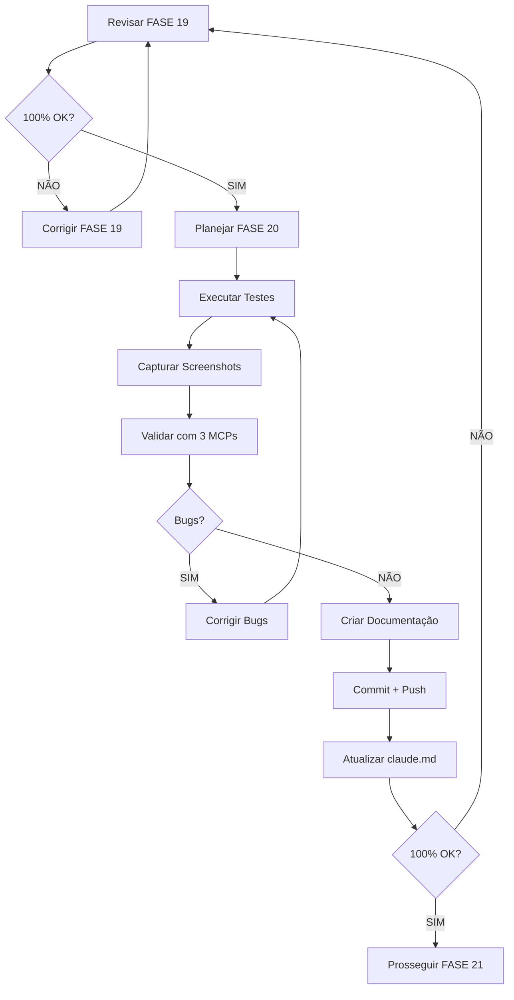

# CHECKLIST - FASE 20: Estados e Transições

**Data:** 2025-11-13
**Responsável:** Claude Code (Sonnet 4.5)
**Projeto:** B3 AI Analysis Platform (invest-claude-web)
**Status:** 📋 PLANEJAMENTO

---

## 📋 PRÉ-REQUISITOS

### ✅ Revisão FASE 19 (Obrigatório)
- [ ] Ler VALIDACAO_FASE_19_INTEGRACOES.md completo
- [ ] Verificar se todos os itens foram implementados
- [ ] Identificar gaps e pendências
- [ ] Verificar se há bugs ou warnings
- [ ] Validar se código está 100% funcional
- [ ] Confirmar que git está atualizado

### ✅ Verificação de Dependências
- [ ] Backend rodando sem erros
- [ ] Frontend rodando sem erros
- [ ] PostgreSQL ativo
- [ ] Redis ativo
- [ ] Todos os containers healthy

### ✅ Documentação Atualizada
- [ ] claude.md reflete estado atual
- [ ] README.md atualizado
- [ ] VALIDACAO_FRONTEND_COMPLETA.md consultado
- [ ] REFATORACAO_SISTEMA_REPORTS.md consultado

---

## 🎯 OBJETIVOS DA FASE 20

### Escopo
Validar que todos os estados e transições da aplicação estão implementados corretamente:
1. **Loading States** - Skeletons, spinners, progress bars
2. **Error States** - Mensagens de erro, retry, fallbacks
3. **Empty States** - Mensagens quando não há dados
4. **Success States** - Confirmações, toasts, feedback visual

### Páginas a Validar
- [ ] `/dashboard` - Estados de carregamento dos cards
- [ ] `/assets` - Tabela loading, empty, error
- [ ] `/analysis` - Análises loading, error, empty
- [ ] `/portfolio` - Posições loading, empty, error
- [ ] `/reports` - Lista loading, detalhes loading, downloads
- [ ] `/data-sources` - Status scrapers, loading
- [ ] `/settings` - Salvamento, validação

---

## 📝 TODO LIST - FASE 20

### 1️⃣ PRÉ-EXECUÇÃO
- [ ] Revisar FASE 19 completa (OBRIGATÓRIO)
- [ ] Verificar git status (deve estar limpo)
- [ ] Verificar git log (último commit deve ser FASE 19)
- [ ] Executar `system-manager.ps1 status` (todos serviços UP)
- [ ] Verificar porta 3100 (frontend acessível)
- [ ] Verificar porta 3101 (backend acessível)

### 2️⃣ ANÁLISE E PLANEJAMENTO
- [ ] Ler VALIDACAO_FRONTEND_COMPLETA.md - FASE 20
- [ ] Listar todos os estados a validar
- [ ] Identificar componentes com loading states
- [ ] Identificar componentes com error states
- [ ] Identificar componentes com empty states
- [ ] Criar mapa de cobertura de testes

### 3️⃣ TESTES - LOADING STATES
- [ ] Dashboard: Skeleton cards durante fetch
- [ ] Assets: Skeleton tabela durante sync
- [ ] Analysis: Spinner botão "Solicitar Análise"
- [ ] Portfolio: Loading posições
- [ ] Reports: Loading lista + detalhes
- [ ] Data Sources: Loading status scrapers
- [ ] Settings: Loading ao salvar
- [ ] Screenshots: Capturar evidências (cada página)

### 4️⃣ TESTES - ERROR STATES
- [ ] Simular erro 401 (logout automático)
- [ ] Simular erro 500 (mensagem de erro)
- [ ] Simular erro network (offline)
- [ ] Validar botões "Tentar Novamente"
- [ ] Validar toasts de erro (cor, mensagem)
- [ ] Validar error boundaries (fallback UI)
- [ ] Screenshots: Capturar estados de erro

### 5️⃣ TESTES - EMPTY STATES
- [ ] Portfolio vazio: Mensagem + CTA
- [ ] Análises vazias: Mensagem + botão
- [ ] Relatórios vazios: Mensagem + ação
- [ ] Busca sem resultados: "Nenhum resultado"
- [ ] Validar mensagens amigáveis
- [ ] Validar CTAs (Call-to-Action)
- [ ] Screenshots: Capturar empty states

### 6️⃣ TESTES - SUCCESS STATES
- [ ] Login: Redirect + toast sucesso
- [ ] Análise solicitada: Toast confirmação
- [ ] Posição adicionada: Toast + atualização
- [ ] Settings salvos: Toast "Salvo com sucesso"
- [ ] Download PDF: Toast + arquivo baixado
- [ ] Validar toasts (cor verde, ícone check)
- [ ] Screenshots: Capturar success states

### 7️⃣ VALIDAÇÃO CRUZADA (3 MCPs)
- [ ] Playwright: Validar estados em múltiplas páginas
- [ ] Selenium: Validar estados em browsers diferentes
- [ ] Chrome DevTools: Validar console, network, performance
- [ ] React DevTools: Validar estados de componentes
- [ ] Comparar resultados entre MCPs (devem ser idênticos)

### 8️⃣ DOCUMENTAÇÃO
- [ ] Criar VALIDACAO_FASE_20_ESTADOS_TRANSICOES.md
- [ ] Documentar todos os testes executados
- [ ] Incluir screenshots (mínimo 10)
- [ ] Documentar problemas encontrados
- [ ] Documentar soluções aplicadas
- [ ] Incluir métricas de cobertura

### 9️⃣ CORREÇÕES (Se Necessário)
- [ ] Listar todos os bugs encontrados
- [ ] Priorizar bugs (crítico, alto, médio, baixo)
- [ ] Corrigir bugs críticos (bloqueantes)
- [ ] Corrigir bugs altos (importantes)
- [ ] Validar correções (testar novamente)
- [ ] Atualizar documentação de correções

### 🔟 COMMIT E PUSH
- [ ] Verificar TypeScript (0 erros)
- [ ] Verificar console (0 erros)
- [ ] Verificar git status
- [ ] Stage arquivos (VALIDACAO_FASE_20_*.md, claude.md)
- [ ] Commit com mensagem detalhada
- [ ] Push para origin/main
- [ ] Verificar GitHub (commit visível)

---

## 🔍 CRITÉRIOS DE APROVAÇÃO

### Mínimo para Aprovar FASE 20
1. ✅ Todos os loading states implementados e funcionais
2. ✅ Todos os error states implementados e funcionais
3. ✅ Todos os empty states implementados e funcionais
4. ✅ Todos os success states implementados e funcionais
5. ✅ 0 erros console em todas as páginas
6. ✅ 0 erros TypeScript
7. ✅ Screenshots capturados (mínimo 10)
8. ✅ Documentação completa (VALIDACAO_FASE_20_*.md)
9. ✅ Git 100% atualizado
10. ✅ Validação cruzada com 3 MCPs (todos aprovados)

### Bloqueadores (NÃO pode avançar se existir)
- ❌ Qualquer erro crítico no console
- ❌ Qualquer estado faltando ou quebrado
- ❌ Qualquer erro TypeScript
- ❌ Git desatualizado
- ❌ Documentação incompleta

---

## 🚨 REGRAS OBRIGATÓRIAS

### Antes de Executar
1. ✅ **SEMPRE** revisar fase anterior (FASE 19)
2. ✅ **SEMPRE** verificar se fase anterior está 100%
3. ✅ **SEMPRE** ler documentação completa (VALIDACAO_FASE_19_*.md)
4. ✅ **NUNCA** pular etapas
5. ✅ **NUNCA** ter pressa

### Durante a Execução
1. ✅ **SEMPRE** usar dados reais (não mocks)
2. ✅ **SEMPRE** testar em múltiplos browsers
3. ✅ **SEMPRE** capturar screenshots
4. ✅ **SEMPRE** validar com 3 MCPs
5. ✅ **SEMPRE** documentar tudo

### Depois da Execução
1. ✅ **SEMPRE** commitar mudanças
2. ✅ **SEMPRE** fazer push
3. ✅ **SEMPRE** atualizar claude.md
4. ✅ **SEMPRE** verificar GitHub
5. ✅ **SEMPRE** confirmar 100% antes de avançar

---

## 📊 PROGRESSO ESPERADO

### Antes da FASE 20
- Fases Completas: 19/21 (90.5%)
- Testes Aprovados: 323/328+ (98.5%)

### Depois da FASE 20
- Fases Completas: 20/21 (95.2%)
- Testes Aprovados: ~335/340+ (98.5%+)
- Faltando: Apenas FASE 21 (Acessibilidade)

---

## 🔄 WORKFLOW COMPLETO

---

## 📚 REFERÊNCIAS

### Documentação do Projeto
- `VALIDACAO_FRONTEND_COMPLETA.md` - Plano geral (21 fases)
- `VALIDACAO_FASE_19_INTEGRACOES.md` - Fase anterior
- `REFATORACAO_SISTEMA_REPORTS.md` - Arquitetura Reports
- `claude.md` - Documentação principal

### Ferramentas Necessárias
- Playwright MCP (testes E2E)
- Selenium MCP (cross-browser)
- Chrome DevTools MCP (debugging)
- React DevTools (estados componentes)
- system-manager.ps1 (gerenciar ambiente)

---

**Criado por:** Claude Code (Sonnet 4.5)
**Data:** 2025-11-13

🤖 Generated with [Claude Code](https://claude.com/claude-code)

Co-Authored-By: Claude <noreply@anthropic.com>
