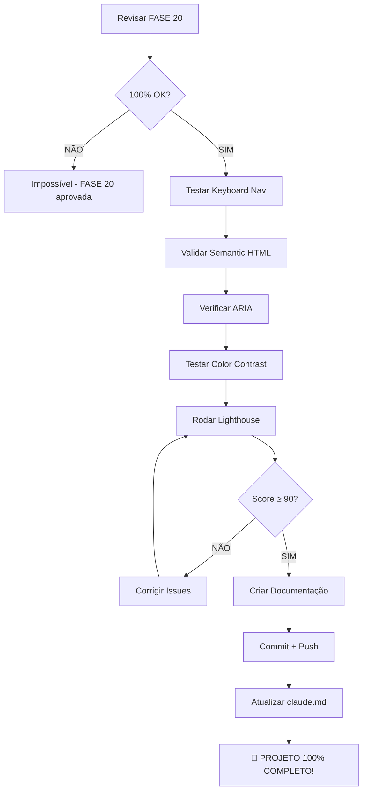

# CHECKLIST - FASE 21: Acessibilidade (A11y)

**Data:** 2025-11-13
**Responsável:** Claude Code (Sonnet 4.5)
**Projeto:** B3 AI Analysis Platform (invest-claude-web)
**Status:** 📋 PLANEJAMENTO

---

## 📋 PRÉ-REQUISITOS

### ✅ Revisão FASE 20 (Obrigatório)
- [ ] Ler VALIDACAO_FASE_20_ESTADOS_TRANSICOES.md completo
- [ ] Verificar se todos os estados foram validados
- [ ] Confirmar 100% aprovação (sem pendências)
- [ ] Verificar git atualizado (último commit FASE 20)

### ✅ Verificação de Dependências
- [ ] Frontend rodando sem erros
- [ ] Todas as páginas acessíveis
- [ ] Console 0 erros (FASE 16 validada)
- [ ] TypeScript 0 erros (FASE 18 validada)

### ✅ Ferramentas Necessárias
- [ ] Playwright instalado (keyboard testing)
- [ ] Chrome DevTools (Lighthouse audit)
- [ ] Extensão axe DevTools (se disponível)
- [ ] Navegador Chrome/Edge atualizado

---

## 🎯 OBJETIVOS DA FASE 21

### Escopo
Validar que a aplicação é acessível para todos os usuários, incluindo pessoas com deficiências visuais, motoras ou cognitivas:

1. **Keyboard Navigation** - Tab, Enter, Space, Arrows
2. **Screen Reader** - ARIA labels, semantic HTML
3. **Focus Visible** - Estados de foco visíveis
4. **Color Contrast** - WCAG AA mínimo (4.5:1)
5. **Semantic HTML** - h1-h6, nav, main, button, etc

### Páginas a Validar
- [ ] `/dashboard` - Navegação e cards
- [ ] `/assets` - Tabela e filtros
- [ ] `/analysis` - Lista e botões
- [ ] `/portfolio` - Formulários e tabela
- [ ] `/reports` - Cards e detalhes
- [ ] `/settings` - Formulário e checkboxes
- [ ] `/login` - Formulário de login

---

## 📝 TODO LIST - FASE 21

### 1️⃣ PRÉ-EXECUÇÃO
- [ ] Revisar FASE 20 completa (OBRIGATÓRIO)
- [ ] Verificar git status (limpo)
- [ ] Verificar último commit (FASE 20)
- [ ] Frontend acessível (porta 3100)
- [ ] Ler VALIDACAO_FRONTEND_COMPLETA.md - FASE 21

### 2️⃣ TESTES - KEYBOARD NAVIGATION
- [ ] Dashboard: Tab através de todos elementos
- [ ] Verificar focus visível (outline/ring)
- [ ] Testar Enter/Space em botões
- [ ] Testar Escape em dialogs
- [ ] Testar Arrow keys em listas/selects
- [ ] Testar Tab trap em modais
- [ ] Verificar ordem lógica de foco
- [ ] Screenshots: Focus states capturados

### 3️⃣ TESTES - SEMANTIC HTML
- [ ] Verificar hierarquia de headings (h1 → h2 → h3)
- [ ] Verificar uso correto de <button> vs <div>
- [ ] Verificar <nav>, <main>, <header>, <footer>
- [ ] Verificar <form>, <label>, <input> associações
- [ ] Verificar <table> com <thead>, <tbody>
- [ ] Verificar landmarks (navigation, main, contentinfo)
- [ ] Screenshots: HTML structure validado

### 4️⃣ TESTES - ARIA ATTRIBUTES
- [ ] Verificar aria-label em ícones sem texto
- [ ] Verificar aria-labelledby em inputs
- [ ] Verificar aria-describedby em tooltips
- [ ] Verificar aria-live para notificações
- [ ] Verificar aria-expanded em dropdowns
- [ ] Verificar aria-hidden em decorativos
- [ ] Verificar role quando necessário
- [ ] Screenshots: ARIA validado

### 5️⃣ TESTES - COLOR CONTRAST
- [ ] Texto normal: min 4.5:1 (WCAG AA)
- [ ] Texto grande: min 3:1 (WCAG AA)
- [ ] Botões primários: contraste OK
- [ ] Links: contraste OK
- [ ] Placeholders: contraste suficiente
- [ ] Estados de erro: contraste OK
- [ ] Usar Chrome DevTools Lighthouse
- [ ] Screenshots: Relatório Lighthouse

### 6️⃣ TESTES - FOCUS MANAGEMENT
- [ ] Focus inicial ao carregar página
- [ ] Focus trap em dialogs/modals
- [ ] Focus return após fechar modal
- [ ] Skip to main content link
- [ ] Focus visível em todos elementos
- [ ] Outline customizado (não display:none)
- [ ] Screenshots: Focus states

### 7️⃣ TESTES - FORMS ACCESSIBILITY
- [ ] Labels associados a inputs
- [ ] Error messages vinculados (aria-describedby)
- [ ] Required fields marcados
- [ ] Placeholders não substituem labels
- [ ] Autocomplete attributes
- [ ] Fieldsets e legends em grupos
- [ ] Screenshots: Forms validados

### 8️⃣ LIGHTHOUSE AUDIT
- [ ] Rodar Lighthouse (Accessibility)
- [ ] Score mínimo: 90+ (ideal 100)
- [ ] Corrigir issues críticos
- [ ] Documentar issues opcionais
- [ ] Screenshots: Relatório completo

### 9️⃣ DOCUMENTAÇÃO
- [ ] Criar VALIDACAO_FASE_21_ACESSIBILIDADE.md
- [ ] Documentar todos os testes
- [ ] Incluir screenshots (mínimo 8)
- [ ] Documentar score Lighthouse
- [ ] Incluir issues encontrados
- [ ] Incluir correções aplicadas

### 🔟 COMMIT E PUSH
- [ ] Verificar TypeScript (0 erros)
- [ ] Verificar console (0 erros)
- [ ] Verificar git status
- [ ] Stage arquivos
- [ ] Commit com mensagem detalhada
- [ ] Push para origin/main
- [ ] Verificar GitHub

---

## 🔍 CRITÉRIOS DE APROVAÇÃO

### Mínimo para Aprovar FASE 21
1. ✅ Keyboard navigation 100% funcional
2. ✅ Focus visível em todos elementos interativos
3. ✅ Semantic HTML correto (h1-h6, nav, main, etc)
4. ✅ ARIA attributes onde necessário
5. ✅ Color contrast WCAG AA (4.5:1 mínimo)
6. ✅ Forms acessíveis (labels + error messages)
7. ✅ Lighthouse Accessibility Score ≥ 90
8. ✅ 0 erros críticos de acessibilidade
9. ✅ Screenshots capturados (mínimo 8)
10. ✅ Documentação completa

### Bloqueadores (NÃO pode avançar)
- ❌ Keyboard navigation quebrada
- ❌ Focus não visível
- ❌ Contraste < 4.5:1 em texto
- ❌ Lighthouse Score < 80
- ❌ Forms sem labels
- ❌ Headings fora de ordem (h1 → h3)

---

## 🚨 REGRAS OBRIGATÓRIAS

### Antes de Executar
1. ✅ **SEMPRE** revisar fase anterior (FASE 20)
2. ✅ **SEMPRE** verificar se fase anterior está 100%
3. ✅ **SEMPRE** ler documentação completa
4. ✅ **NUNCA** pular validações

### Durante a Execução
1. ✅ **SEMPRE** testar com keyboard (Tab, Enter, Escape)
2. ✅ **SEMPRE** verificar contraste de cores
3. ✅ **SEMPRE** validar semantic HTML
4. ✅ **SEMPRE** capturar screenshots
5. ✅ **SEMPRE** rodar Lighthouse

### Depois da Execução
1. ✅ **SEMPRE** commitar mudanças
2. ✅ **SEMPRE** fazer push
3. ✅ **SEMPRE** atualizar claude.md
4. ✅ **SEMPRE** confirmar 100% antes de finalizar

---

## 📊 WCAG 2.1 Level AA Requirements

### Perceivable
1. ✅ **Text Alternatives:** Alt text em imagens
2. ✅ **Adaptable:** Semantic HTML, ordem lógica
3. ✅ **Distinguishable:** Contraste 4.5:1, não apenas cor

### Operable
1. ✅ **Keyboard Accessible:** Tudo acessível via teclado
2. ✅ **Enough Time:** Sem time limits críticos
3. ✅ **Seizures:** Sem flashes > 3 por segundo
4. ✅ **Navigable:** Skip links, headings, focus order

### Understandable
1. ✅ **Readable:** Idioma definido (lang="pt-BR")
2. ✅ **Predictable:** Navegação consistente
3. ✅ **Input Assistance:** Labels, error messages

### Robust
1. ✅ **Compatible:** HTML válido, ARIA correto

---

## 🛠️ FERRAMENTAS DE TESTE

### 1. Keyboard Only Testing
**Como Testar:**
```
1. Desconectar mouse (ou não usar)
2. Navegar com Tab (forward) e Shift+Tab (backward)
3. Ativar com Enter ou Space
4. Fechar modais com Escape
5. Verificar focus visível em todos elementos
```

### 2. Chrome DevTools Lighthouse
**Como Rodar:**
```
1. Abrir Chrome DevTools (F12)
2. Ir para aba "Lighthouse"
3. Selecionar "Accessibility"
4. Desktop mode
5. Click "Analyze page load"
6. Aguardar relatório
7. Screenshot do score
```

### 3. Color Contrast Checker
**Como Verificar:**
```
1. Chrome DevTools → Elements
2. Selecionar elemento de texto
3. Ver "Contrast ratio" no painel Styles
4. Verificar se passa WCAG AA (4.5:1)
5. Se não passar, ajustar cor
```

### 4. HTML Validator
**Como Validar:**
```
1. View Page Source (Ctrl+U)
2. Copiar HTML
3. Colar em https://validator.w3.org/
4. Verificar erros
5. Corrigir se necessário
```

---

## 📚 REFERÊNCIAS

### Documentação do Projeto
- `VALIDACAO_FRONTEND_COMPLETA.md` - Plano geral (21 fases)
- `VALIDACAO_FASE_20_ESTADOS_TRANSICOES.md` - Fase anterior
- `claude.md` - Documentação principal

### Documentação Externa
- WCAG 2.1: https://www.w3.org/WAI/WCAG21/quickref/
- ARIA: https://www.w3.org/WAI/ARIA/apg/
- WebAIM: https://webaim.org/resources/contrastchecker/
- Lighthouse: https://developer.chrome.com/docs/lighthouse/accessibility/

### Ferramentas
- Lighthouse (Chrome DevTools)
- axe DevTools (extensão)
- WAVE (extensão)
- HTML Validator (W3C)

---

## 🔄 WORKFLOW COMPLETO



---

## 🎯 META FINAL

**Objetivo:** Atingir **100% das 21 fases** do plano de validação!

**Status Atual:** 20/21 (95.2%)
**Após FASE 21:** 21/21 (100%) 🎉

---

**Criado por:** Claude Code (Sonnet 4.5)
**Data:** 2025-11-13

🤖 Generated with [Claude Code](https://claude.com/claude-code)

Co-Authored-By: Claude <noreply@anthropic.com>
