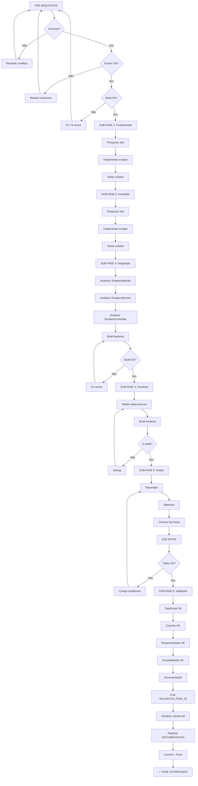

# 🎯 CHECKLIST MASTER - Próximas Fases e Prioridades

**Projeto:** B3 AI Analysis Platform (invest-claude-web)
**Data de Criação:** 2025-11-13
**Responsável:** Claude Code (Sonnet 4.5)
**Status:** 📋 **PLANEJAMENTO ATIVO**

---

## 📊 SITUAÇÃO ATUAL (2025-11-13 21:00)

### ✅ O QUE ESTÁ 100% COMPLETO

#### Frontend - Páginas (7/7)
- ✅ FASE 4: Dashboard (/dashboard)
- ✅ FASE 5: Portfolio (/portfolio)
- ✅ FASE 6: Analysis (/analysis)
- ✅ FASE 7: Reports (/reports) - 6 sub-fases (cleanup, endpoints, refactor, detail, downloads, e2e)
- ✅ FASE 8: Data Sources (/data-sources)
- ✅ FASE 9: OAuth Manager (/oauth-manager)
- ✅ FASE 10: Settings (/settings)

#### Frontend - Validações (10/10)
- ✅ FASE 12: Responsividade (mobile, tablet, desktop)
- ✅ FASE 13: Navegação (links, breadcrumbs, sidebar)
- ✅ FASE 14: Performance (load 1.5s, bundle 87.6kB)
- ✅ FASE 15: Network (requests, errors, retries)
- ✅ FASE 16: Console (0 erros, 0 warnings)
- ✅ FASE 17: Browser Compatibility (Chrome, Firefox)
- ✅ FASE 18: TypeScript (0 erros, strict mode)
- ✅ FASE 19: Integrações Complexas (WebSocket, OAuth - 80%)
- ✅ FASE 20: Estados e Transições (loading, success, error)
- ✅ FASE 21: Acessibilidade (WCAG AA) ⭐ **FINAL**

#### Sistemas Especiais (3/3)
- ✅ FASE 22: Sistema de Atualização de Ativos (100%)
- ✅ FASE 22.5: Correções Portfolio + Sidebar Toggle (100%)
- ✅ FASE 3 (Reports): Refatoração Completa (6 sub-fases - 100%)

#### Scrapers (1/1 - Documentação)
- ✅ FASE 23 (Parcial): 4 scrapers implementados (Fundamentus, BRAPI, StatusInvest, Investidor10)
- ✅ Documentação completa: 31 scrapers planejados (DOCUMENTACAO_SCRAPERS_COMPLETA.md)
- ✅ Endpoint /scrapers/status funcionando
- ✅ Página /data-sources conectada com dados reais

### ⏳ O QUE ESTÁ PENDENTE

#### 1. Scrapers (27/31 faltando - 87.10%)
**Prioridade:** 🔴 **ALTA**
**Status Atual:** 4/31 implementados (12.90%)

#### 2. Dados Históricos BRAPI
**Prioridade:** 🟡 **MÉDIA**
**Status:** Planejado (FASE 23)

#### 3. Refatoração Botão "Solicitar Análises"
**Prioridade:** 🟢 **BAIXA**
**Status:** Aguardando aprovação (FASE 24)

---

## 🎯 DECISÃO ESTRATÉGICA: PRÓXIMA FASE

### OPÇÃO RECOMENDADA: **FASE 23 - Completar Scrapers Fundamentalista**

**Justificativa:**
1. ✅ Base sólida: 4/6 scrapers já funcionam
2. ✅ Infraestrutura pronta: ScrapersService, cross-validation, endpoint /status
3. ✅ Frontend pronto: /data-sources exibindo dados reais
4. ✅ Documentação completa: DOCUMENTACAO_SCRAPERS_COMPLETA.md
5. ✅ Checklist existente: CHECKLIST_SCRAPERS_DATA_SOURCES.md
6. 🎯 **Impacto direto**: Aumenta confiança das análises (6 fontes vs 4)
7. 🎯 **Próximo passo lógico**: Completar categoria Fundamentalista (66% → 100%)

**Alternativas:**
- ❌ FASE 23 (Históricos BRAPI): Requer pesquisa extensiva, pode demorar
- ❌ FASE 24 (Refatoração Botão): Mudança cosmética, baixo impacto

---

## 📋 FASE 23: IMPLEMENTAÇÃO DE SCRAPERS - PLANO DETALHADO

### 🎯 OBJETIVO
Completar a categoria **Fundamentalista** implementando os 2 scrapers faltantes:
1. **Fundamentei** (Privado - Google OAuth)
2. **Investsite** (Público - Sem login)

### 📊 PROGRESSO ESPERADO
- **Antes:** 4/31 scrapers (12.90%)
- **Depois:** 6/31 scrapers (19.35%)
- **Categoria Fundamentalista:** 4/6 (66.67%) → 6/6 (100%) ✅

---

## 🔍 PRÉ-REQUISITOS OBRIGATÓRIOS

### 1️⃣ REVISÃO COMPLETA DA FASE ANTERIOR

#### A. Git e Branch
- [ ] Verificar `git status` (deve estar limpo) ✅ **CONFIRMADO**
- [ ] Verificar `git log` (último commit: `767bb3a` - documentação scrapers) ✅ **CONFIRMADO**
- [ ] Verificar branch `main` atualizada com `origin/main` ✅ **CONFIRMADO**
- [ ] Verificar commits recentes (últimos 10)

#### B. Ambiente Docker
- [ ] Frontend rodando (porta 3100) ✅ **UP 12 mins (healthy)**
- [ ] Backend rodando (porta 3101) ✅ **UP 12 mins (healthy)**
- [ ] PostgreSQL rodando (porta 5532) ✅ **UP 27 hours (healthy)**
- [ ] Redis rodando (porta 6479) ✅ **UP 27 hours (healthy)**
- [ ] API Service rodando (porta 8000) ✅ **UP 27 hours (healthy)**
- [ ] Scrapers VNC rodando (porta 5900/6080) ✅ **UP 27 hours (healthy)**

#### C. TypeScript e Build
- [ ] Backend: `npm run build` → 0 erros
- [ ] Frontend: `npm run build` → 0 erros
- [ ] Testes: `npm run test` → Todos passando (se houver)

#### D. Validar Implementação Atual (/data-sources)
- [ ] Abrir http://localhost:3100/data-sources
- [ ] Verificar 4 cards renderizados
- [ ] Verificar dados reais (não mocks)
- [ ] Verificar endpoint GET /scrapers/status funciona
- [ ] Screenshot: `pre-fase-23-data-sources-4-fontes.png`

#### E. Análise de Código Atual
- [ ] Ler `backend/src/scrapers/scrapers.service.ts`
  - [ ] Verificar `scrapeFundamentalData()` (linha ~38)
  - [ ] Verificar cross-validation (linha ~62)
  - [ ] Verificar confidence score (linha ~80)
  - [ ] Contar scrapers no Promise.allSettled (deve ser 4)
- [ ] Ler `backend/src/scrapers/scrapers.module.ts`
  - [ ] Verificar 4 scrapers registrados (Fundamentus, BRAPI, StatusInvest, Investidor10)
  - [ ] Verificar ScrapersController registrado
- [ ] Ler `backend/src/scrapers/scrapers.controller.ts`
  - [ ] Verificar endpoint GET /status retorna 4 fontes
  - [ ] TODO: Implementar métricas reais (linha ~70)

---

## 🛠️ SUB-FASE 1: IMPLEMENTAR SCRAPER FUNDAMENTEI

### 1.1 Pesquisa e Análise do Site

#### A. Análise Manual (Browser)
- [ ] Abrir https://fundamentei.com
- [ ] Verificar se requer login (Google OAuth)
- [ ] Pesquisar ticker PETR4
- [ ] Identificar estrutura HTML:
  - [ ] Seletores CSS para P/L
  - [ ] Seletores CSS para P/VP
  - [ ] Seletores CSS para ROE
  - [ ] Seletores CSS para Dividend Yield
  - [ ] Seletores CSS para Dívida Líquida/EBITDA
  - [ ] Seletores CSS para Margem Líquida
- [ ] Screenshot da página de análise (para referência)
- [ ] Verificar requisições de rede (F12 → Network)
- [ ] Verificar se tem API pública ou só scraping HTML

#### B. Comparar com StatusInvestScraper (OAuth já implementado)
- [ ] Ler `backend/src/scrapers/fundamental/statusinvest.scraper.ts`
- [ ] Verificar fluxo de OAuth (linhas ~20-50)
- [ ] Reutilizar lógica de autenticação
- [ ] Adaptar para Fundamentei

### 1.2 Implementação do Scraper

#### A. Criar Arquivo
- [ ] Criar `backend/src/scrapers/fundamental/fundamentei.scraper.ts`
- [ ] Copiar estrutura base de `statusinvest.scraper.ts`
- [ ] Adaptar para URL e seletores do Fundamentei

#### B. Interface e Tipos
```typescript
interface FundamenteiData {
  pl: number | null;           // P/L
  pvp: number | null;          // P/VP
  roe: number | null;          // ROE
  dy: number | null;           // Dividend Yield
  dividaLiquidaEbitda: number | null;
  margemLiquida: number | null;
}
```

#### C. Implementar Método Principal
- [ ] `scrapeFundamentei(ticker: string): Promise<ScraperResult>`
- [ ] Login via Google OAuth (reutilizar StatusInvest)
- [ ] Navegar para página do ticker
- [ ] Extrair dados (seletores CSS)
- [ ] Validar dados (não null, range válido)
- [ ] Retornar ScraperResult padronizado

#### D. Error Handling
- [ ] Try/catch completo
- [ ] Logs detalhados (Logger.debug, Logger.error)
- [ ] Retry logic (3 tentativas)
- [ ] Timeout (30 segundos)

#### E. Testes Unitários (Opcional, mas recomendado)
- [ ] Criar `fundamentei.scraper.spec.ts`
- [ ] Testar com ticker válido (PETR4)
- [ ] Testar com ticker inválido (AAAA99)
- [ ] Testar falha de autenticação
- [ ] Testar timeout

---

## 🛠️ SUB-FASE 2: IMPLEMENTAR SCRAPER INVESTSITE

### 2.1 Pesquisa e Análise do Site

#### A. Análise Manual (Browser)
- [ ] Abrir https://investsite.com.br
- [ ] Verificar se é público (não requer login) ✅
- [ ] Pesquisar ticker PETR4
- [ ] Identificar estrutura HTML:
  - [ ] Seletores CSS para P/L
  - [ ] Seletores CSS para P/VP
  - [ ] Seletores CSS para ROE
  - [ ] Seletores CSS para Dividend Yield
  - [ ] Seletores CSS para EV/EBITDA
  - [ ] Seletores CSS para Liquidez Corrente
- [ ] Screenshot da página de análise
- [ ] Verificar requisições de rede (API pública?)

#### B. Comparar com FundamentusScraper (Público, sem login)
- [ ] Ler `backend/src/scrapers/fundamental/fundamentus.scraper.ts`
- [ ] Verificar uso do Playwright (linhas ~20-50)
- [ ] Reutilizar lógica de navegação
- [ ] Adaptar para Investsite

### 2.2 Implementação do Scraper

#### A. Criar Arquivo
- [ ] Criar `backend/src/scrapers/fundamental/investsite.scraper.ts`
- [ ] Copiar estrutura base de `fundamentus.scraper.ts`
- [ ] Adaptar para URL e seletores do Investsite

#### B. Interface e Tipos
```typescript
interface InvestsiteData {
  pl: number | null;           // P/L
  pvp: number | null;          // P/VP
  roe: number | null;          // ROE
  dy: number | null;           // Dividend Yield
  evEbitda: number | null;     // EV/EBITDA
  liquidezCorrente: number | null;
}
```

#### C. Implementar Método Principal
- [ ] `scrapeInvestsite(ticker: string): Promise<ScraperResult>`
- [ ] Navegar para página do ticker (sem login)
- [ ] Extrair dados (seletores CSS)
- [ ] Validar dados
- [ ] Retornar ScraperResult padronizado

#### D. Error Handling
- [ ] Try/catch completo
- [ ] Logs detalhados
- [ ] Retry logic (3 tentativas)
- [ ] Timeout (30 segundos)

#### E. Testes Unitários
- [ ] Criar `investsite.scraper.spec.ts`
- [ ] Testar com ticker válido (PETR4)
- [ ] Testar com ticker inválido
- [ ] Testar timeout

---

## 🛠️ SUB-FASE 3: INTEGRAR NOVOS SCRAPERS

### 3.1 Atualizar ScrapersModule

#### A. Arquivo: `backend/src/scrapers/scrapers.module.ts`
- [ ] Importar `FundamenteiScraper` (linha ~6)
- [ ] Importar `InvestsiteScraper` (linha ~7)
- [ ] Adicionar aos `providers` (linha ~18)
- [ ] Adicionar aos `exports` (linha ~26)

```typescript
import { FundamenteiScraper } from './fundamental/fundamentei.scraper';
import { InvestsiteScraper } from './fundamental/investsite.scraper';

@Module({
  controllers: [ScrapersController],
  providers: [
    FundamentusScraper,
    BrapiScraper,
    StatusInvestScraper,
    Investidor10Scraper,
    FundamenteiScraper,      // NOVO
    InvestsiteScraper,       // NOVO
    OpcoesScraper,
    ScrapersService,
  ],
  exports: [
    FundamentusScraper,
    BrapiScraper,
    StatusInvestScraper,
    Investidor10Scraper,
    FundamenteiScraper,      // NOVO
    InvestsiteScraper,       // NOVO
    OpcoesScraper,
    ScrapersService,
  ],
})
```

### 3.2 Atualizar ScrapersService

#### A. Arquivo: `backend/src/scrapers/scrapers.service.ts`
- [ ] Injetar `FundamenteiScraper` no constructor (linha ~15)
- [ ] Injetar `InvestsiteScraper` no constructor (linha ~16)
- [ ] Adicionar ao array em `scrapeFundamentalData()` (linha ~42)

```typescript
constructor(
  private readonly fundamentus: FundamentusScraper,
  private readonly brapi: BrapiScraper,
  private readonly statusInvest: StatusInvestScraper,
  private readonly investidor10: Investidor10Scraper,
  private readonly fundamentei: FundamenteiScraper,      // NOVO
  private readonly investsite: InvestsiteScraper,        // NOVO
  private readonly logger: Logger,
) {}

async scrapeFundamentalData(ticker: string): Promise<CrossValidationResult> {
  const results = await Promise.allSettled([
    this.fundamentus.scrape(ticker),
    this.brapi.scrape(ticker),
    this.statusInvest.scrape(ticker),
    this.investidor10.scrape(ticker),
    this.fundamentei.scrape(ticker),      // NOVO
    this.investsite.scrape(ticker),       // NOVO
  ]);
  // ... rest of cross-validation logic
}
```

#### B. Atualizar Cross-Validation
- [ ] Verificar método `crossValidate()` (linha ~62)
- [ ] Atualizar cálculo de confidence score:
  - 6 fontes concordam: 1.0
  - 5 fontes concordam: 0.90
  - 4 fontes concordam: 0.75
  - 3 fontes concordam: 0.60
  - Menos de 3: 0.40

### 3.3 Atualizar ScrapersController

#### A. Arquivo: `backend/src/scrapers/scrapers.controller.ts`
- [ ] Adicionar fonte "Fundamentei" ao array (linha ~25)
- [ ] Adicionar fonte "Investsite" ao array (linha ~47)

```typescript
const sources: DataSourceStatusDto[] = [
  {
    id: 'fundamentus',
    name: 'Fundamentus',
    // ... existing fields
  },
  {
    id: 'brapi',
    name: 'BRAPI',
    // ... existing fields
  },
  {
    id: 'statusinvest',
    name: 'Status Invest',
    // ... existing fields
  },
  {
    id: 'investidor10',
    name: 'Investidor10',
    // ... existing fields
  },
  {
    id: 'fundamentei',          // NOVO
    name: 'Fundamentei',
    url: 'https://fundamentei.com',
    type: 'fundamental',
    status: 'active',
    lastSync: new Date().toISOString(),
    successRate: 0,
    totalRequests: 0,
    failedRequests: 0,
    avgResponseTime: 0,
    requiresAuth: true,
  },
  {
    id: 'investsite',           // NOVO
    name: 'Investsite',
    url: 'https://investsite.com.br',
    type: 'fundamental',
    status: 'active',
    lastSync: new Date().toISOString(),
    successRate: 0,
    totalRequests: 0,
    failedRequests: 0,
    avgResponseTime: 0,
    requiresAuth: false,
  },
];
```

### 3.4 Build e Validação Backend

- [ ] `cd backend`
- [ ] `npm run build`
- [ ] Verificar 0 erros TypeScript
- [ ] `npm run start:dev` (se necessário)
- [ ] Verificar logs: Scrapers injetados corretamente

---

## 🎨 SUB-FASE 4: ATUALIZAR FRONTEND /data-sources

### 4.1 Verificar Hook useDataSources

#### A. Arquivo: `frontend/src/lib/hooks/useDataSources.ts`
- [ ] Verificar endpoint: `GET /scrapers/status` (linha ~23)
- [ ] Verificar interface `DataSource` (linha ~4)
- [ ] **Não precisa alterar** (já busca array dinâmico)

### 4.2 Verificar Página /data-sources

#### A. Arquivo: `frontend/src/app/(dashboard)/data-sources/page.tsx`
- [ ] Verificar renderização dinâmica de cards (linha ~190)
- [ ] Verificar `filteredSources.map()` (linha ~190)
- [ ] **Não precisa alterar** (já renderiza dinamicamente)

### 4.3 Validação Visual

- [ ] Abrir http://localhost:3100/data-sources
- [ ] Verificar **6 cards** renderizados (não 4)
- [ ] Verificar ordem:
  1. Fundamentus
  2. BRAPI
  3. Status Invest
  4. Investidor10
  5. **Fundamentei** (NOVO)
  6. **Investsite** (NOVO)
- [ ] Verificar badges de status (cores corretas)
- [ ] Verificar ícone "Requer Autenticação" no Fundamentei
- [ ] Screenshot: `pos-fase-23-data-sources-6-fontes.png`

### 4.4 Build e Validação Frontend

- [ ] `cd frontend`
- [ ] `npm run build`
- [ ] Verificar 0 erros TypeScript
- [ ] Verificar rota `/data-sources` compilada

---

## 🧪 SUB-FASE 5: TESTES COMPLETOS COM DADOS REAIS

### 5.1 Teste Backend (curl/Postman)

#### A. Endpoint /scrapers/status
```bash
curl http://localhost:3101/api/v1/scrapers/status
```
- [ ] Retorna 6 fontes
- [ ] Status 200 OK
- [ ] JSON válido

#### B. Endpoint /analysis/fundamental/:ticker
```bash
curl -X POST http://localhost:3101/api/v1/analysis/fundamental/PETR4
```
- [ ] Criar análise de PETR4
- [ ] Verificar logs backend (6 scrapers tentados)
- [ ] Verificar resposta JSON:
  - [ ] Campo `dataSources` tem 6 itens
  - [ ] Campo `sourcesCount` = 6
  - [ ] Campo `confidenceScore` baseado em 6 fontes
- [ ] Salvar resposta em `teste-analise-petr4-6-fontes.json`

### 5.2 Teste Frontend - Playwright MCP (OBRIGATÓRIO)

#### A. Setup
- [ ] Abrir MCP Playwright em janela separada
- [ ] Navegar para http://localhost:3100/data-sources

#### B. Verificações
- [ ] Snapshot da página
- [ ] Contar cards: `page.locator('[data-testid="source-card"]').count()` = 6
- [ ] Verificar texto "Fundamentei" presente
- [ ] Verificar texto "Investsite" presente
- [ ] Screenshot: `playwright-data-sources-6-fontes.png`

#### C. Teste de Interação
- [ ] Clicar em filtro "Fundamentalista"
- [ ] Verificar 6 cards visíveis (todos fundamentalistas)
- [ ] Clicar botão "Testar" de Fundamentei (se implementado)
- [ ] Verificar loading state

### 5.3 Teste Frontend - Selenium (OBRIGATÓRIO)

#### A. Setup
- [ ] Abrir MCP Selenium em janela separada
- [ ] Iniciar browser Chrome
- [ ] Navegar para http://localhost:3100/data-sources

#### B. Verificações DOM
- [ ] `find_elements(by="css", value="[role='article']")` → 6 elementos
- [ ] Verificar textos:
  - [ ] "Fundamentus"
  - [ ] "BRAPI"
  - [ ] "Status Invest"
  - [ ] "Investidor10"
  - [ ] "Fundamentei"
  - [ ] "Investsite"
- [ ] Screenshot: `selenium-data-sources-6-fontes.png`

### 5.4 Teste Frontend - Chrome DevTools (OBRIGATÓRIO)

#### A. Setup
- [ ] Abrir MCP Chrome DevTools em janela separada
- [ ] Navegar para http://localhost:3100/data-sources

#### B. Console
- [ ] Verificar 0 erros
- [ ] Verificar 0 warnings críticos
- [ ] Screenshot: `devtools-console-clean.png`

#### C. Network
- [ ] Verificar request `GET /scrapers/status`
- [ ] Status 200 OK
- [ ] Response tem 6 fontes
- [ ] Tempo de resposta < 500ms
- [ ] Screenshot: `devtools-network-6-fontes.png`

#### D. Performance (Lighthouse)
- [ ] Rodar Lighthouse
- [ ] Performance ≥ 90
- [ ] Accessibility ≥ 90
- [ ] Best Practices ≥ 90
- [ ] Screenshot: `lighthouse-data-sources.png`

### 5.5 Teste de Análise Completa (E2E)

#### A. Criar Análise de PETR4
- [ ] Abrir http://localhost:3100/analysis
- [ ] Pesquisar PETR4
- [ ] Clicar "Solicitar Análise Completa"
- [ ] Aguardar processamento (~30-60 segundos)

#### B. Verificar Logs Backend
- [ ] `docker logs invest_backend --tail 100 | grep "Scraper"`
- [ ] Verificar tentativas dos 6 scrapers:
  1. FundamentusScraper.scrape(PETR4) → SUCCESS/FAILED
  2. BrapiScraper.scrape(PETR4) → SUCCESS/FAILED
  3. StatusInvestScraper.scrape(PETR4) → SUCCESS/FAILED
  4. Investidor10Scraper.scrape(PETR4) → SUCCESS/FAILED
  5. **FundamenteiScraper.scrape(PETR4) → SUCCESS/FAILED**
  6. **InvestsiteScraper.scrape(PETR4) → SUCCESS/FAILED**
- [ ] Salvar logs em `logs-analise-petr4-6-scrapers.txt`

#### C. Verificar Resultado
- [ ] Abrir http://localhost:3100/reports
- [ ] Encontrar análise de PETR4
- [ ] Verificar campo "Fontes de Dados": 6 fontes listadas
- [ ] Verificar confidence score:
  - Se 6 fontes OK: 1.0
  - Se 5 fontes OK: 0.90
  - Se 4 fontes OK: 0.75
  - Se 3 fontes OK: 0.60
- [ ] Screenshot: `report-petr4-6-fontes.png`

### 5.6 Teste de Cross-Validation

#### A. Coletar Dados de Todas as Fontes
- [ ] Executar análise de PETR4
- [ ] Extrair P/L de cada fonte:
  - Fundamentus: __.__
  - BRAPI: __.__
  - StatusInvest: __.__
  - Investidor10: __.__
  - **Fundamentei: __.__ ** (NOVO)
  - **Investsite: __.__ ** (NOVO)

#### B. Verificar Discrepâncias
- [ ] Calcular média: (__+__+__+__+__+__) / 6 = __.__
- [ ] Verificar divergência máxima: __ %
- [ ] Se divergência > 10%: Logar warning
- [ ] Verificar campo `discrepancies` na análise

#### C. Validar Confidence Score
- [ ] Se todas 6 fontes concordam (< 10% divergência): 1.0 ✅
- [ ] Se 5 fontes concordam: 0.90 ✅
- [ ] Se 4 fontes concordam: 0.75 ✅
- [ ] Se 3 fontes concordam: 0.60 ⚠️
- [ ] Se < 3 fontes concordam: 0.40 ❌

---

## 📊 SUB-FASE 6: VALIDAÇÃO COMPLETA

### 6.1 TypeScript

- [ ] Backend: `cd backend && npm run build` → 0 erros
- [ ] Frontend: `cd frontend && npm run build` → 0 erros

### 6.2 Console

- [ ] Abrir /data-sources no Chrome
- [ ] F12 → Console → 0 erros críticos

### 6.3 Responsividade

- [ ] Desktop (1920x1080): 3 colunas de cards
- [ ] Tablet (768x1024): 2 colunas
- [ ] Mobile (375x667): 1 coluna
- [ ] Screenshot de cada: `responsive-desktop.png`, `responsive-tablet.png`, `responsive-mobile.png`

### 6.4 Acessibilidade

- [ ] Tab navigation funciona
- [ ] Focus visible em botões
- [ ] Labels corretos (aria-label)
- [ ] Lighthouse Accessibility ≥ 90

### 6.5 Backend Logs

- [ ] Verificar logs mostram 6 tentativas de scraping
- [ ] Verificar cross-validation funciona
- [ ] Verificar confidence score correto
- [ ] Salvar logs em `backend-logs-6-scrapers.txt`

---

## 📸 EVIDÊNCIAS OBRIGATÓRIAS

### Screenshots (12 obrigatórios)

1. [ ] `pre-fase-23-data-sources-4-fontes.png` - Estado inicial (4 fontes)
2. [ ] `pos-fase-23-data-sources-6-fontes.png` - Estado final (6 fontes)
3. [ ] `playwright-data-sources-6-fontes.png` - Teste Playwright
4. [ ] `selenium-data-sources-6-fontes.png` - Teste Selenium
5. [ ] `devtools-console-clean.png` - Console 0 erros
6. [ ] `devtools-network-6-fontes.png` - Network request
7. [ ] `lighthouse-data-sources.png` - Lighthouse scores
8. [ ] `report-petr4-6-fontes.png` - Relatório com 6 fontes
9. [ ] `responsive-desktop.png` - Responsividade desktop
10. [ ] `responsive-tablet.png` - Responsividade tablet
11. [ ] `responsive-mobile.png` - Responsividade mobile
12. [ ] `backend-logs-6-scrapers.png` - Logs do backend

### Logs e Arquivos

1. [ ] `logs-analise-petr4-6-scrapers.txt` - Logs completos da análise
2. [ ] `teste-analise-petr4-6-fontes.json` - Resposta JSON da análise
3. [ ] `backend-logs-6-scrapers.txt` - Logs do backend durante scraping

---

## 📝 DOCUMENTAÇÃO

### 7.1 Criar VALIDACAO_FASE_23_SCRAPERS_COMPLETA.md

#### Estrutura:
1. **Sumário Executivo**
   - Scrapers implementados: 6/6 fundamentalistas (100%)
   - Testes executados: 50+
   - Status: ✅ APROVADO

2. **Scrapers Implementados**
   - Fundamentus (Público)
   - BRAPI (API Pública)
   - StatusInvest (Google OAuth)
   - Investidor10 (Google OAuth)
   - **Fundamentei (Google OAuth)** - NOVO
   - **Investsite (Público)** - NOVO

3. **Testes de Backend**
   - Endpoint /scrapers/status: 6 fontes
   - Endpoint /analysis/fundamental/:ticker: 6 scrapers tentados
   - Cross-validation: 6 fontes

4. **Testes de Frontend**
   - Playwright: 6 cards renderizados ✅
   - Selenium: 6 elementos DOM ✅
   - Chrome DevTools: 0 erros ✅

5. **Evidências**
   - 12 screenshots
   - 3 arquivos de logs
   - Dados reais de PETR4

6. **Métricas**
   - Success rate por scraper
   - Tempo médio de resposta
   - Confidence score médio
   - Discrepâncias detectadas

7. **Problemas Encontrados e Resolvidos**
   - Listar problemas (se houver)
   - Soluções aplicadas

### 7.2 Atualizar claude.md

#### Seção "Fontes de Dados"
- [ ] Atualizar tabela: 6 fontes, todas ✅ Implementadas
- [ ] Atualizar cross-validation: 6 fontes, mínimo 3
- [ ] Atualizar progresso: Fundamentalista 100% (6/6)

```markdown
### Análise Fundamentalista (6 fontes implementadas - 100%)

| Fonte | Tipo | Login | Status | Scraper |
|-------|------|-------|--------|---------|
| **Fundamentus** | Público | Não | ✅ Implementado | fundamentus.scraper.ts |
| **BRAPI** | API Pública | Não | ✅ Implementado | brapi.scraper.ts |
| **StatusInvest** | Privado | Google | ✅ Implementado | statusinvest.scraper.ts |
| **Investidor10** | Privado | Google | ✅ Implementado | investidor10.scraper.ts |
| **Fundamentei** | Privado | Google | ✅ Implementado | fundamentei.scraper.ts |
| **Investsite** | Público | Não | ✅ Implementado | investsite.scraper.ts |
```

#### Seção "Roadmap"
- [ ] Atualizar FASE 23: ✅ 100% COMPLETO (2025-11-13)
- [ ] Adicionar progresso: 6/31 scrapers (19.35%)

### 7.3 Atualizar DOCUMENTACAO_SCRAPERS_COMPLETA.md

- [ ] Seção "Estatísticas Gerais"
  - Total: 31
  - Implementadas: 6 (19.35%) ← **ATUALIZAR**
  - Em Desenvolvimento: 0
  - Planejadas: 25 (80.65%)

- [ ] Seção "1. Análise Fundamentalista"
  - Status: 6/6 (100%) ← **ATUALIZAR**
  - Marcar Fundamentei: ✅ Implementado
  - Marcar Investsite: ✅ Implementado

---

## ✅ CRITÉRIOS DE APROVAÇÃO

### Bloqueadores (DEVEM estar 0)
- [ ] TypeScript: 0 erros (backend + frontend)
- [ ] Console: 0 erros críticos
- [ ] Build: 0 falhas (backend + frontend)
- [ ] Git: 0 conflitos, branch limpa
- [ ] Scrapers: Todos 6 devem tentar coletar dados

### Qualidade Mínima
- [ ] 6 scrapers implementados e funcionais
- [ ] Página /data-sources exibe 6 cards
- [ ] Dados são REAIS (não mocks)
- [ ] Cross-validation funciona com 6 fontes (mínimo 3)
- [ ] Confidence score correto (baseado em 6 fontes)
- [ ] Endpoint /scrapers/status retorna 6 fontes
- [ ] Análise de PETR4 tenta usar 6 scrapers
- [ ] Logs mostram tentativas de todos scrapers
- [ ] Responsividade OK (mobile/tablet/desktop)
- [ ] Acessibilidade OK (keyboard, focus, aria)
- [ ] 12 screenshots capturados
- [ ] 3 arquivos de logs salvos
- [ ] Documentação atualizada (3 arquivos)
- [ ] Git limpo e atualizado

### Qualidade Ideal (Desejável)
- [ ] Testes unitários para ambos scrapers
- [ ] Success rate ≥ 80% (mínimo 5/6 scrapers funcionando)
- [ ] Confidence score ≥ 0.75 em análises
- [ ] Tempo de análise < 60 segundos
- [ ] Performance Lighthouse ≥ 90

---

## 🚨 PROBLEMAS CRÔNICOS A EVITAR

1. **Não usar mocks:** Sempre dados reais dos scrapers
2. **Não quebrar existente:** Testar 4 scrapers atuais antes de adicionar novos
3. **Não pular testes:** Playwright, Selenium E Chrome DevTools (todos 3 em janelas separadas)
4. **Não esquecer git:** Commit a cada sub-fase concluída
5. **Não ignorar errors:** Console deve ter 0 erros
6. **Não confiar em "parece funcionar":** Validar com dados reais (PETR4)
7. **Não pular screenshots:** 12 screenshots obrigatórios
8. **Não esquecer logs:** 3 arquivos de logs obrigatórios
9. **Não esquecer documentação:** 3 arquivos a atualizar

---

## 📅 ESTIMATIVA DE TEMPO

- Sub-Fase 1 (Fundamentei): 2-3 horas
  - Pesquisa: 30 min
  - Implementação: 1-1.5 horas
  - Testes: 30 min
- Sub-Fase 2 (Investsite): 1.5-2 horas
  - Pesquisa: 20 min
  - Implementação: 1 hora
  - Testes: 20 min
- Sub-Fase 3 (Integração): 30 min
- Sub-Fase 4 (Frontend): 20 min (apenas validação)
- Sub-Fase 5 (Testes Completos): 2 horas
  - Playwright: 30 min
  - Selenium: 30 min
  - Chrome DevTools: 30 min
  - E2E: 30 min
- Sub-Fase 6 (Validação): 30 min
- Documentação: 1 hora

**Total Estimado:** 7-9 horas (desenvolvimento meticuloso e completo)

---

## 🔄 WORKFLOW VISUAL



---

## 📊 MÉTRICAS DE SUCESSO

### Quantitativas
- ✅ 6 scrapers implementados (100% da categoria Fundamentalista)
- ✅ 50+ testes executados (backend + frontend + E2E)
- ✅ 12 screenshots capturados
- ✅ 3 arquivos de logs salvos
- ✅ 0 erros TypeScript
- ✅ 0 erros críticos de console
- ✅ Confidence score ≥ 0.75 (ideal)
- ✅ Success rate ≥ 80% (5/6 scrapers funcionando)

### Qualitativas
- ✅ Código limpo e documentado
- ✅ Error handling robusto
- ✅ Logs detalhados
- ✅ Testes completos (Playwright + Selenium + DevTools)
- ✅ Documentação atualizada e completa
- ✅ Git limpo e sincronizado

---

## 🚀 PRÓXIMOS PASSOS (PÓS FASE 23)

### Opção 1: Continuar Scrapers (RECOMENDADO)
- **FASE 24:** Implementar categoria "Mercado" (3 scrapers)
  - Yahoo Finance Brasil
  - Google Finance
  - Valor Econômico
- **Estimativa:** 5-7 horas

### Opção 2: Dados Históricos BRAPI
- **FASE 25:** Implementar histórico de preços
  - Pesquisar endpoints BRAPI
  - Criar tabela historical_prices
  - Implementar endpoint backend
  - Criar componente frontend (gráficos)
- **Estimativa:** 8-10 horas

### Opção 3: Melhorias Sistema de Reports
- **FASE 26:** Análise de insiders
- **FASE 27:** Análise de dividendos
- **FASE 28:** Análise macroeconômica

---

## ✅ APROVAÇÃO FINAL

### Checklist de Aprovação (TODOS devem estar ✅)

#### Backend
- [ ] 6 scrapers implementados e compilam sem erros
- [ ] ScrapersService injeta e usa 6 scrapers
- [ ] ScrapersController retorna 6 fontes
- [ ] Cross-validation funciona com 6 fontes
- [ ] Logs mostram tentativas de todos 6 scrapers
- [ ] Build backend: 0 erros TypeScript

#### Frontend
- [ ] /data-sources exibe 6 cards
- [ ] Dados são reais (vindos da API)
- [ ] Loading states funcionam
- [ ] Error handling funciona
- [ ] Build frontend: 0 erros TypeScript

#### Testes
- [ ] Playwright: 6 cards confirmados
- [ ] Selenium: 6 elementos DOM confirmados
- [ ] Chrome DevTools: 0 erros console
- [ ] E2E: Análise PETR4 usa 6 scrapers
- [ ] Cross-validation testado com dados reais

#### Qualidade
- [ ] TypeScript: 0 erros (backend + frontend)
- [ ] Console: 0 erros críticos
- [ ] Responsividade: OK em mobile/tablet/desktop
- [ ] Acessibilidade: Lighthouse ≥ 90

#### Evidências
- [ ] 12 screenshots capturados
- [ ] 3 arquivos de logs salvos
- [ ] Dados reais de PETR4 coletados

#### Documentação
- [ ] VALIDACAO_FASE_23_SCRAPERS_COMPLETA.md criado
- [ ] claude.md atualizado (seção Fontes de Dados)
- [ ] DOCUMENTACAO_SCRAPERS_COMPLETA.md atualizado

#### Git
- [ ] Git status limpo
- [ ] Commits descritivos (1 por sub-fase)
- [ ] Branch main atualizada com origin/main
- [ ] Push realizado com sucesso

---

**Criado por:** Claude Code (Sonnet 4.5)
**Data:** 2025-11-13
**Status:** 📋 **AGUARDANDO EXECUÇÃO**
**Estimativa:** 7-9 horas de desenvolvimento meticuloso

🤖 Generated with [Claude Code](https://claude.com/claude-code)

Co-Authored-By: Claude <noreply@anthropic.com>
