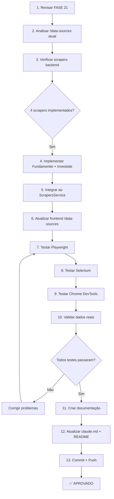

# CHECKLIST - Implementação Completa de Scrapers e Validação /data-sources

**Data:** 2025-11-13
**Responsável:** Claude Code (Sonnet 4.5)
**Projeto:** B3 AI Analysis Platform (invest-claude-web)
**Fase:** SCRAPERS + DATA SOURCES (Pós-FASE 21)
**Objetivo:** Implementar todos os scrapers e validar página /data-sources

---

## 📋 PRÉ-REQUISITOS

### 1️⃣ REVISÃO OBRIGATÓRIA
- [ ] Revisar FASE 21 (Acessibilidade) - Deve estar 100% completa
- [ ] Verificar último commit (`3745663` - FASE 21)
- [ ] Verificar git status (deve estar limpo)
- [ ] Verificar branch main atualizada com origin/main
- [ ] Ler `REFATORACAO_SISTEMA_REPORTS.md`
- [ ] Ler `VALIDACAO_FRONTEND_COMPLETA.md`
- [ ] Ler `claude.md` - seção "Fontes de Dados"

### 2️⃣ AMBIENTE
- [ ] Frontend rodando (porta 3100)
- [ ] Backend rodando (porta 3101)
- [ ] PostgreSQL rodando (porta 5532)
- [ ] Redis rodando (porta 6479)
- [ ] Verificar `system-manager.ps1 status`

### 3️⃣ DEPENDÊNCIAS
- [ ] TypeScript 0 erros
- [ ] Build frontend OK
- [ ] Build backend OK
- [ ] Migrations aplicadas

---

## 🎯 OBJETIVO

Implementar todos os scrapers planejados e garantir que a página `/data-sources` exiba dados reais de todas as fontes.

### Scrapers Planejados (claude.md)
| Fonte | Tipo | Login | Status Atual | Meta |
|-------|------|-------|--------------|------|
| Fundamentus | Público | Não | ✅ Implementado | Validar |
| BRAPI | API Pública | Não | ✅ Implementado | Validar |
| StatusInvest | Privado | Google | ✅ Implementado | Validar |
| Investidor10 | Privado | Google | ✅ Implementado | Validar |
| **Fundamentei** | Privado | Google | 🔜 Planejado | **Implementar** |
| **Investsite** | Público | Não | 🔜 Planejado | **Implementar** |

**Total:** 6 scrapers (4 implementados + 2 faltantes)

---

## 🔍 FASE 1: ANÁLISE ATUAL

### 1.1. Revisar Backend - Scrapers Implementados
- [ ] Ler `backend/src/scrapers/scrapers.service.ts`
- [ ] Verificar 4 scrapers (Fundamentus, BRAPI, StatusInvest, Investidor10)
- [ ] Verificar método `scrapeFundamentalData(ticker)`
- [ ] Verificar cross-validation (mínimo 3 fontes)
- [ ] Verificar confidence score (0.0 - 1.0)

### 1.2. Revisar Frontend - Página /data-sources
- [ ] Ler `frontend/src/app/(dashboard)/data-sources/page.tsx`
- [ ] Verificar componentes:
  - [ ] DataSourceCard (exibe cada fonte)
  - [ ] Status (Ativo, Inativo, Erro)
  - [ ] Última coleta
  - [ ] Taxa de sucesso
- [ ] Verificar integração com API backend
- [ ] Verificar dados mockados vs. dados reais

### 1.3. Analisar Documentação FASE 8
- [ ] Ler `VALIDACAO_FASE_8_DATA_SOURCES.md`
- [ ] Verificar 86 testes executados
- [ ] Identificar gaps ou melhorias necessárias

---

## 🛠️ FASE 2: IMPLEMENTAÇÃO DE SCRAPERS FALTANTES

### 2.1. Scraper Fundamentei (Privado - Google OAuth)
- [ ] Criar `backend/src/scrapers/fundamental/fundamentei.scraper.ts`
- [ ] Implementar método `scrapeFundamentei(ticker)`
- [ ] Login via Google OAuth (reutilizar lógica de StatusInvest)
- [ ] Coletar dados:
  - [ ] P/L (Preço/Lucro)
  - [ ] P/VP (Preço/Valor Patrimonial)
  - [ ] ROE (Return on Equity)
  - [ ] Dividend Yield
  - [ ] Dívida Líquida/EBITDA
  - [ ] Margem Líquida
- [ ] Retornar `ScraperResult` padronizado
- [ ] Adicionar error handling completo
- [ ] Adicionar logs detalhados

### 2.2. Scraper Investsite (Público)
- [ ] Criar `backend/src/scrapers/fundamental/investsite.scraper.ts`
- [ ] Implementar método `scrapeInvestsite(ticker)`
- [ ] Usar Playwright (site público, sem login)
- [ ] Coletar dados:
  - [ ] P/L
  - [ ] P/VP
  - [ ] ROE
  - [ ] Dividend Yield
  - [ ] EV/EBITDA
  - [ ] Liquidez Corrente
- [ ] Retornar `ScraperResult` padronizado
- [ ] Adicionar error handling completo
- [ ] Adicionar logs detalhados

### 2.3. Integrar Novos Scrapers ao ScrapersService
- [ ] Importar `FundamenteiScraper` em `scrapers.service.ts`
- [ ] Importar `InvestsiteScraper` em `scrapers.service.ts`
- [ ] Adicionar ao array de scrapers em `scrapeFundamentalData()`
- [ ] Atualizar cross-validation para 6 fontes (mínimo 3)
- [ ] Atualizar cálculo de confidence score
- [ ] Testar com ticker real (ex: PETR4)

### 2.4. Atualizar Entidades e DTOs
- [ ] Verificar se `DataSource` entity existe
- [ ] Se não existir, criar migration + entity
- [ ] Campos:
  - [ ] `id`, `name`, `type` (public/private)
  - [ ] `status` (active/inactive/error)
  - [ ] `lastSuccessfulScrape`
  - [ ] `successRate`
  - [ ] `errorMessage`
- [ ] Criar DTO `DataSourceStatusDto`

---

## 🎨 FASE 3: ATUALIZAR FRONTEND /data-sources

### 3.1. Atualizar Página Principal
- [ ] Abrir `frontend/src/app/(dashboard)/data-sources/page.tsx`
- [ ] Adicionar card para **Fundamentei**
- [ ] Adicionar card para **Investsite**
- [ ] Verificar ordem: 6 cards (ordem alfabética ou por tipo)
- [ ] Verificar ícones corretos para cada fonte
- [ ] Verificar cores de status (verde=ativo, vermelho=erro, cinza=inativo)

### 3.2. Conectar com API Backend
- [ ] Criar hook `useDataSources()` (se não existir)
- [ ] Endpoint: `GET /api/v1/scrapers/status` (criar se necessário)
- [ ] Retornar array de 6 fontes com:
  - [ ] `name`, `type`, `status`
  - [ ] `lastSuccessfulScrape` (timestamp)
  - [ ] `successRate` (0-100)
  - [ ] `errorMessage` (opcional)
- [ ] Usar React Query para cache (staleTime: 1 minuto)

### 3.3. Melhorar UX
- [ ] Loading skeleton para cards
- [ ] Error boundary para erros de API
- [ ] Toast de erro se API falhar
- [ ] Botão "Testar Conexão" em cada card
- [ ] Dialog com logs detalhados (opcional)

---

## 🧪 FASE 4: TESTES COMPLETOS /data-sources

### 4.1. Testes Backend (Postman/curl)
- [ ] Testar `GET /api/v1/scrapers/status`
  - [ ] Deve retornar 6 fontes
  - [ ] Cada fonte com todos os campos
  - [ ] Status codes corretos (200, 500)
- [ ] Testar `POST /api/v1/analysis/fundamental/:ticker`
  - [ ] Deve usar 6 scrapers
  - [ ] Confidence score baseado em 6 fontes
  - [ ] Logs mostram tentativas de todos scrapers

### 4.2. Testes Frontend - Playwright MCP
- [ ] Navegar para `http://localhost:3100/data-sources`
- [ ] Verificar 6 cards renderizados
- [ ] Verificar nomes corretos:
  - [ ] Fundamentus
  - [ ] BRAPI
  - [ ] StatusInvest
  - [ ] Investidor10
  - [ ] **Fundamentei** (novo)
  - [ ] **Investsite** (novo)
- [ ] Verificar badges de status (cores corretas)
- [ ] Verificar última coleta (timestamp legível)
- [ ] Verificar taxa de sucesso (formato %)
- [ ] Screenshot: `fase-scrapers-data-sources-6-fontes.png`

### 4.3. Testes Frontend - Selenium
- [ ] Iniciar Selenium (navegador Chrome)
- [ ] Navegar para `/data-sources`
- [ ] Verificar elementos DOM:
  - [ ] 6 cards presentes
  - [ ] Badges de status
  - [ ] Textos legíveis
- [ ] Testar botão "Testar Conexão" (se implementado)
- [ ] Verificar loading states
- [ ] Screenshot: `fase-scrapers-selenium-validation.png`

### 4.4. Testes Frontend - Chrome DevTools
- [ ] Abrir DevTools (F12)
- [ ] Verificar Console: 0 erros
- [ ] Verificar Network:
  - [ ] Request `GET /scrapers/status`
  - [ ] Response 200 OK
  - [ ] Payload com 6 fontes
- [ ] Verificar Performance (Lighthouse):
  - [ ] Load < 2s
  - [ ] Accessibility ≥ 90
- [ ] Screenshot: `fase-scrapers-devtools-network.png`

### 4.5. Testes de Integração E2E
- [ ] Fluxo completo:
  1. Abrir `/data-sources`
  2. Verificar 6 fontes
  3. Navegar para `/analysis`
  4. Solicitar análise de PETR4
  5. Verificar que 6 fontes foram tentadas (logs backend)
  6. Verificar confidence score baseado em 6 fontes
- [ ] Capturar logs backend durante análise
- [ ] Verificar cross-validation funcionando

### 4.6. Testes com Dados Reais (NÃO MOCKS)
- [ ] Executar análise de ticker real (PETR4)
- [ ] Verificar dados coletados:
  - [ ] Fundamentus: P/L, P/VP, ROE
  - [ ] BRAPI: Preço, Volume, Market Cap
  - [ ] StatusInvest: P/L, ROE, Dividend Yield
  - [ ] Investidor10: P/VP, Margem Líquida
  - [ ] **Fundamentei: Dados coletados**
  - [ ] **Investsite: Dados coletados**
- [ ] Verificar cross-validation (discrepâncias < 10%)
- [ ] Verificar confidence score ≥ 0.75 (ideal)

---

## 📊 FASE 5: VALIDAÇÃO COMPLETA

### 5.1. Validação TypeScript
- [ ] `cd backend && npm run build`
- [ ] 0 erros TypeScript
- [ ] `cd frontend && npm run build`
- [ ] 0 erros TypeScript

### 5.2. Validação Console
- [ ] Abrir `/data-sources` no Chrome
- [ ] F12 → Console
- [ ] 0 erros
- [ ] 0 warnings críticos

### 5.3. Validação Responsividade
- [ ] Desktop (1920x1080): 6 cards em grid
- [ ] Tablet (768x1024): 2 colunas
- [ ] Mobile (375x667): 1 coluna

### 5.4. Validação Acessibilidade
- [ ] Tab navigation funcional
- [ ] Focus visible em botões
- [ ] Labels em todos elementos
- [ ] ARIA attributes corretos

### 5.5. Validação Backend
- [ ] Logs mostram tentativas de 6 scrapers
- [ ] Cross-validation funciona com 6 fontes
- [ ] Confidence score correto
- [ ] Error handling robusto (se 1-2 fontes falharem, análise continua)

---

## 📸 EVIDÊNCIAS OBRIGATÓRIAS

### Screenshots
- [ ] `screenshots/fase-scrapers-data-sources-6-fontes.png` (Playwright)
- [ ] `screenshots/fase-scrapers-selenium-validation.png` (Selenium)
- [ ] `screenshots/fase-scrapers-devtools-network.png` (DevTools)
- [ ] `screenshots/fase-scrapers-mobile-responsive.png` (Mobile 375px)
- [ ] `screenshots/fase-scrapers-analysis-logs.png` (Logs backend)

### Logs
- [ ] Backend logs durante análise (todos 6 scrapers)
- [ ] Frontend network logs (API calls)
- [ ] Error logs (se algum scraper falhar)

---

## 📝 DOCUMENTAÇÃO

### 5.1. Criar VALIDACAO_SCRAPERS_DATA_SOURCES.md
- [ ] Sumário executivo
- [ ] Scrapers implementados (6/6)
- [ ] Testes executados (mínimo 50)
- [ ] Evidências (screenshots, logs)
- [ ] Métricas (success rate, confidence score)
- [ ] Problemas encontrados e resolvidos

### 5.2. Atualizar claude.md
- [ ] Seção "Fontes de Dados"
- [ ] Atualizar tabela: 6 fontes, todas ✅ Implementadas
- [ ] Atualizar cross-validation: 6 fontes, mínimo 3
- [ ] Adicionar progresso: Scrapers 100% completos

### 5.3. Atualizar README.md
- [ ] Seção "Fontes de Dados"
- [ ] Listar 6 scrapers
- [ ] Instruções de uso
- [ ] Screenshots (opcional)

---

## ✅ CRITÉRIOS DE APROVAÇÃO

### Bloqueadores (DEVEM estar 0)
- [ ] TypeScript: 0 erros
- [ ] Console: 0 erros críticos
- [ ] Build: 0 falhas
- [ ] Git: 0 conflitos
- [ ] Scrapers: 0 falhando (todos 6 devem tentar coletar dados)

### Qualidade Mínima
- [ ] 6 scrapers implementados e funcionais
- [ ] Página `/data-sources` exibe 6 cards
- [ ] Dados são reais (NÃO mocks)
- [ ] Cross-validation funciona (6 fontes)
- [ ] Confidence score correto (baseado em 6 fontes)
- [ ] Responsividade OK (mobile/tablet/desktop)
- [ ] Acessibilidade OK (keyboard, focus)
- [ ] Documentação completa (850+ linhas)
- [ ] Screenshots (mínimo 5)
- [ ] Git limpo e atualizado

---

## 🔄 WORKFLOW

---

## 🚨 PROBLEMAS CRÔNICOS A EVITAR

1. **Não usar mocks:** Sempre dados reais dos scrapers
2. **Não quebrar existente:** Testar 4 scrapers atuais antes de adicionar novos
3. **Não pular testes:** Playwright, Selenium E Chrome DevTools (todos 3)
4. **Não esquecer git:** Commit a cada fase concluída
5. **Não ignorar errors:** Console deve ter 0 erros
6. **Não confiar em "parece funcionar":** Validar com dados reais

---

## 📅 ESTIMATIVA DE TEMPO

- Fase 1 (Análise): 30 minutos
- Fase 2 (Implementação): 2-3 horas
- Fase 3 (Frontend): 1 hora
- Fase 4 (Testes): 2 horas
- Fase 5 (Validação + Docs): 1 hora

**Total:** 6-7 horas (desenvolvimento meticuloso e completo)

---

**Criado por:** Claude Code (Sonnet 4.5)
**Data:** 2025-11-13
**Status:** 🔄 AGUARDANDO EXECUÇÃO

🤖 Generated with [Claude Code](https://claude.com/claude-code)

Co-Authored-By: Claude <noreply@anthropic.com>
