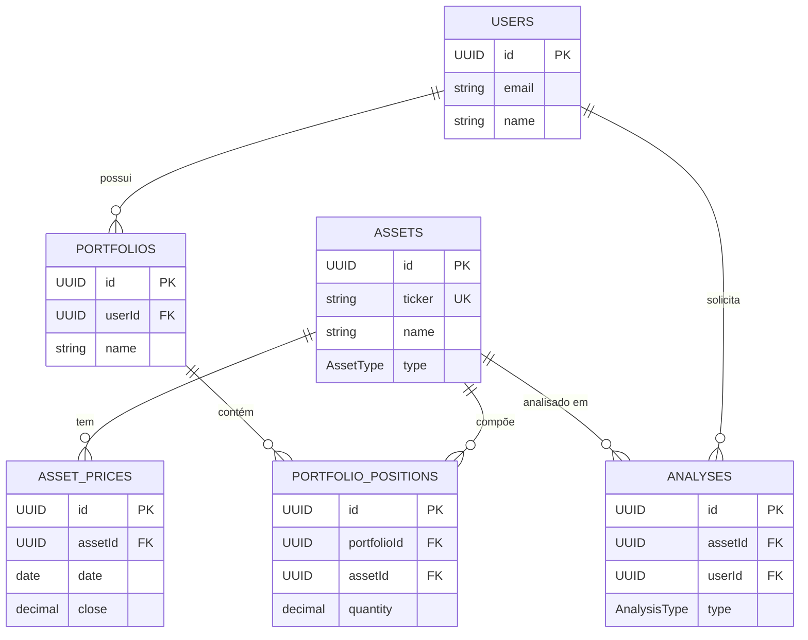

# 🗄️ DATABASE SCHEMA - B3 AI Analysis Platform

**Projeto:** B3 AI Analysis Platform
**Banco de Dados:** PostgreSQL 16.x
**ORM:** TypeORM 0.3.x
**Ultima Atualizacao:** 2025-12-25
**Versao:** 1.13.0

---

## 📋 ÍNDICE

1. [Visão Geral](#visão-geral)
2. [Entidades Principais](#entidades-principais)
3. [Relacionamentos](#relacionamentos)
4. [Indexes e Performance](#indexes-e-performance)
5. [Migrations](#migrations)
6. [Queries Comuns](#queries-comuns)
7. [Diagrama ER](#diagrama-er)

---

## 🎯 VISÃO GERAL

O banco de dados PostgreSQL armazena dados de ativos financeiros da B3, análises fundamentalistas/técnicas realizadas por IA, portfólios de usuários e métricas de scrapers.

### Estatísticas Gerais

- **Total de Tabelas:** 27
- **Total de Registros (aprox.):** 5.000+
  - Assets: 861
  - AssetPrices: 10.000+
  - FundamentalData: 500+
  - Analyses: 100+
  - Users: 10+
  - Portfolios: 20+
  - PortfolioPositions: 50+
  - News: 1.000+
  - NewsAnalysis: 5.000+
  - SentimentConsensus: 1.000+
  - EconomicIndicators: 500+
  - EconomicEvents: 200+
  - Alerts: 50+
  - ScraperMetrics: 100+
  - UpdateLogs: 100+
  - SyncHistory: 100+
  - ScrapedData: 1.000+
  - DataSources: 35+
  - CrossValidationConfig: 20+
  - DiscrepancyResolutions: 50+
  - IntradayPrices: 100.000+ (TimescaleDB)
  - WheelStrategies: 0+ (FASE 101-108)
  - WheelTrades: 0+ (FASE 101-108)
  - OptionPrices: 0+ (FASE 107)
  - **ScraperConfigs: 42 (FASE 142)** - Configuracao dinamica de scrapers
  - **ScraperExecutionProfiles: 4 (FASE 142)** - Perfis de execucao

### Convenções

- **Primary Keys:** UUID (gerado automaticamente)
- **Foreign Keys:** Relacionamentos explícitos com CASCADE/RESTRICT
- **Timestamps:** `createdAt`, `updatedAt` (automáticos via TypeORM)
- **Soft Delete:** Campo `isActive` (não usar DELETE físico)
- **Decimal:** Precision adequada (18,2 para valores monetários, 10,4 para percentuais)

---

## 📊 ENTIDADES PRINCIPAIS

### 1. Assets (Ativos)

Armazena ativos financeiros da B3 (ações, FIIs, ETFs, criptomoedas).

**Schema:**

```typescript
{
  id: UUID; // Primary Key
  ticker: string(UNIQUE); // Ex: PETR4, VALE3, ITUB4
  name: string; // Nome completo (ex: "Petróleo Brasileiro S.A.")
  type: AssetType; // ENUM: stock, fii, etf, crypto
  sector: string; // Setor econômico (ex: "Petróleo e Gás")
  subsector: string; // Subsetor (ex: "Exploração e Produção")
  isActive: boolean; // Soft delete (true = ativo, false = inativo)
  metadata: JSON; // Dados extras flexíveis
  createdAt: timestamp; // Data de criação (automático)
  updatedAt: timestamp; // Data de atualização (automático)
}
```

**Constraints:**

- `ticker` UNIQUE NOT NULL
- `name` NOT NULL
- `type` NOT NULL
- `isActive` DEFAULT true

**Exemplo:**

```json
{
  "id": "a1b2c3d4-e5f6-7890-abcd-ef1234567890",
  "ticker": "PETR4",
  "name": "Petróleo Brasileiro S.A.",
  "type": "stock",
  "sector": "Petróleo e Gás",
  "subsector": "Exploração e Produção",
  "isActive": true,
  "metadata": {
    "isin": "BRPETRACNPR6",
    "exchange": "B3",
    "listingSegment": "Novo Mercado"
  },
  "createdAt": "2025-11-10T10:00:00Z",
  "updatedAt": "2025-11-14T15:30:00Z"
}
```

---

### 2. AssetPrices (Preços)

Armazena histórico de preços diários de ativos (OHLCV + variação).

**Schema:**

```typescript
{
  id: UUID; // Primary Key
  assetId: UUID; // Foreign Key -> Assets.id
  date: date; // Data de referência (ex: 2025-11-14)
  open: decimal(18, 2); // Preço de abertura
  high: decimal(18, 2); // Preço máximo do dia
  low: decimal(18, 2); // Preço mínimo do dia
  close: decimal(18, 2); // Preço de fechamento
  adjustedClose: decimal(18, 2); // Preço ajustado (splits, dividendos)
  volume: bigint; // Volume negociado
  marketCap: decimal(18, 2); // Valor de mercado
  change: decimal(18, 2); // Variação absoluta (R$)
  changePercent: decimal(10, 4); // Variação percentual (%)
  collectedAt: timestamp; // Quando foi coletado dos scrapers
  createdAt: timestamp; // Data de criação (automático)
}
```

**Constraints:**

- `assetId` FOREIGN KEY REFERENCES assets(id) ON DELETE CASCADE
- `date` NOT NULL
- `close` NOT NULL
- UNIQUE (assetId, date) - Um preço por ativo por dia

**Exemplo:**

```json
{
  "id": "b2c3d4e5-f6a7-8901-bcde-f23456789012",
  "assetId": "a1b2c3d4-e5f6-7890-abcd-ef1234567890",
  "date": "2025-11-14",
  "open": 39.5,
  "high": 40.2,
  "low": 39.3,
  "close": 40.0,
  "adjustedClose": 40.0,
  "volume": 25000000,
  "marketCap": 534000000000.0,
  "change": 0.5,
  "changePercent": 1.2658,
  "collectedAt": "2025-11-14T18:00:00Z",
  "createdAt": "2025-11-14T18:05:00Z"
}
```

---

### 3. TickerChanges (Mudanças de Ticker)

Armazena histórico de mudanças de códigos de negociação (ex: ELET3 → AXIA3).

**Schema:**

```typescript
{
  id: UUID; // Primary Key
  oldTicker: string; // Ticker antigo (ex: "ELET3")
  newTicker: string; // Novo ticker (ex: "AXIA3")
  changeDate: date; // Data da mudança
  reason: string; // Motivo (ex: "REBRANDING", "MERGER")
  ratio: decimal(10, 6); // Fator de conversão (default: 1.0)
  createdAt: timestamp; // Data de criação
  updatedAt: timestamp; // Data de atualização
}
```

**Constraints:**

- `oldTicker` NOT NULL
- `newTicker` NOT NULL
- UNIQUE (oldTicker, newTicker)
- Indexes em `oldTicker` e `newTicker` para busca rápida

**Exemplo:**

```json
{
  "id": "c4d5e6f7-g8h9-0123-ijkl-456789012345",
  "oldTicker": "ELET3",
  "newTicker": "AXIA3",
  "changeDate": "2024-08-01",
  "reason": "REBRANDING",
  "ratio": 1.0,
  "createdAt": "2025-11-24T10:00:00Z"
}
```

---

### 4. FundamentalData (Dados Fundamentalistas)

Armazena indicadores fundamentalistas coletados de múltiplas fontes com cross-validation.

**Schema (campos novos FASE 85):**

```typescript
{
  id: UUID;                        // Primary Key
  assetId: UUID;                   // FK para Asset
  referenceDate: date;             // Data de referência

  // Valuation Indicators
  pl: decimal(18, 2);              // Preço/Lucro
  pvp: decimal(18, 2);             // Preço/Valor Patrimonial
  psr: decimal(18, 2);             // Price/Sales Ratio
  evEbitda: decimal(18, 2);        // EV/EBITDA

  // Profitability Indicators
  roe: decimal(10, 4);             // Return on Equity
  roic: decimal(10, 4);            // Return on Invested Capital
  roa: decimal(10, 4);             // Return on Assets
  margemLiquida: decimal(10, 4);   // Margem Líquida

  // Per Share Indicators (FASE 85)
  lpa: decimal(18, 2);             // Lucro por Ação
  vpa: decimal(18, 2);             // Valor Patrimonial por Ação

  // Liquidity Indicators (FASE 85)
  liquidezCorrente: decimal(18, 2); // Liquidez Corrente

  // Metadata
  fieldSources: JSON;              // Cross-validation de fontes
  metadata: JSON;                  // Dados extras

  createdAt: timestamp;
  updatedAt: timestamp;
}
```

**Colunas Adicionadas (FASE 85):**

| Coluna | Tipo | Descrição |
|--------|------|-----------|
| `lpa` | DECIMAL(18,2) | Lucro por Ação |
| `vpa` | DECIMAL(18,2) | Valor Patrimonial por Ação |
| `liquidez_corrente` | DECIMAL(18,2) | Liquidez Corrente |

**Migration:** `1765100000000-AddLpaVpaLiquidezCorrente.ts`

---

### 5. Analyses (Análises)

Armazena análises fundamentalistas/técnicas realizadas por IA com cross-validation de múltiplas fontes.

**Schema:**

```typescript
{
  id: UUID                         // Primary Key
  assetId: UUID                    // Foreign Key -> Assets.id
  userId: UUID                     // Foreign Key -> Users.id
  type: AnalysisType               // ENUM: fundamental, technical, complete
  status: AnalysisStatus           // ENUM: pending, processing, completed, failed
  analysis: JSON                   // Dados da análise (estrutura flexível)
  dataSources: string[]            // Fontes utilizadas (ex: ["Fundamentus", "BRAPI"])
  sourcesCount: number             // Quantidade de fontes (ex: 6)
  confidenceScore: decimal(5,4)    // Score de confiança (0.0000 - 1.0000)
  recommendation: Recommendation   // ENUM: buy, hold, sell
  targetPrice: decimal(18,2)       // Preço-alvo estimado
  errorMessage: string             // Mensagem de erro (se status=failed)
  completedAt: timestamp           // Data de conclusão
  createdAt: timestamp             // Data de criação (automático)
}
```

**Constraints:**

- `assetId` FOREIGN KEY REFERENCES assets(id) ON DELETE CASCADE
- `userId` FOREIGN KEY REFERENCES users(id) ON DELETE SET NULL
- `type` NOT NULL
- `status` NOT NULL DEFAULT 'pending'

**Exemplo:**

```json
{
  "id": "c3d4e5f6-a7b8-9012-cdef-345678901234",
  "assetId": "a1b2c3d4-e5f6-7890-abcd-ef1234567890",
  "userId": "d4e5f6a7-b8c9-0123-def4-56789012345",
  "type": "complete",
  "status": "completed",
  "analysis": {
    "fundamentals": { "pl": 8.5, "pvp": 1.2, "roe": 15.3 },
    "technicals": { "sma20": 39.5, "sma50": 38.2, "rsi": 62 }
  },
  "dataSources": [
    "Fundamentus",
    "BRAPI",
    "StatusInvest",
    "Investidor10",
    "Fundamentei",
    "Investsite"
  ],
  "sourcesCount": 6,
  "confidenceScore": 0.9167,
  "recommendation": "buy",
  "targetPrice": 45.0,
  "errorMessage": null,
  "completedAt": "2025-11-14T16:30:00Z",
  "createdAt": "2025-11-14T16:25:00Z"
}
```

---

### 4. Portfolios (Portfólios)

Armazena portfólios de investimento dos usuários.

**Schema:**

```typescript
{
  id: UUID; // Primary Key
  userId: UUID; // Foreign Key -> Users.id
  name: string; // Nome do portfólio (ex: "Carteira Conservadora")
  description: string; // Descrição opcional
  totalValue: decimal(18, 2); // Valor total atual (calculado)
  totalCost: decimal(18, 2); // Custo total investido (calculado)
  totalProfitLoss: decimal(18, 2); // Lucro/prejuízo total (calculado)
  isActive: boolean; // Soft delete
  createdAt: timestamp; // Data de criação (automático)
  updatedAt: timestamp; // Data de atualização (automático)
}
```

**Constraints:**

- `userId` FOREIGN KEY REFERENCES users(id) ON DELETE CASCADE
- `name` NOT NULL
- `isActive` DEFAULT true

---

### 5. PortfolioPositions (Posições)

Armazena posições (ativos) dentro de cada portfólio.

**Schema:**

```typescript
{
  id: UUID; // Primary Key
  portfolioId: UUID; // Foreign Key -> Portfolios.id
  assetId: UUID; // Foreign Key -> Assets.id
  quantity: decimal(18, 8); // Quantidade de ações/cotas
  averagePrice: decimal(18, 2); // Preço médio de compra
  currentPrice: decimal(18, 2); // Preço atual (atualizado periodicamente)
  totalCost: decimal(18, 2); // Custo total (quantity * averagePrice)
  totalValue: decimal(18, 2); // Valor total (quantity * currentPrice)
  profitLoss: decimal(18, 2); // Lucro/prejuízo (totalValue - totalCost)
  profitLossPercent: decimal(10, 4); // Lucro/prejuízo percentual
  createdAt: timestamp; // Data de criação (automático)
  updatedAt: timestamp; // Data de atualização (automático)
}
```

**Constraints:**

- `portfolioId` FOREIGN KEY REFERENCES portfolios(id) ON DELETE CASCADE
- `assetId` FOREIGN KEY REFERENCES assets(id) ON DELETE RESTRICT
- `quantity` > 0
- UNIQUE (portfolioId, assetId) - Um ativo por portfólio

---

### 6. WheelStrategies (Estratégias WHEEL) - FASE 101-108

Armazena estratégias WHEEL (venda de PUTs e CALLs cobertas) dos usuários.

**Schema:**

```typescript
{
  id: UUID; // Primary Key
  userId: UUID; // Foreign Key -> Users.id
  assetId: UUID; // Foreign Key -> Assets.id
  name: string; // Nome da estratégia
  description: string; // Descrição opcional
  status: WheelStrategyStatus; // ENUM: active, paused, closed
  phase: WheelPhase; // ENUM: selling_puts, holding_shares, selling_calls
  notional: decimal(18, 2); // Capital total alocado
  allocatedCapital: decimal(18, 2); // Capital em uso
  availableCapital: decimal(18, 2); // Capital disponível
  sharesHeld: integer; // Ações em carteira
  averagePrice: decimal(18, 8); // Preço médio das ações
  realizedPnL: decimal(18, 2); // P&L realizado
  unrealizedPnL: decimal(18, 2); // P&L não realizado
  config: JSONB; // Configurações (targetDelta, minROE, etc.)
  createdAt: timestamp;
  updatedAt: timestamp;
}
```

**Constraints:**

- `userId` FOREIGN KEY REFERENCES users(id) ON DELETE CASCADE
- `assetId` FOREIGN KEY REFERENCES assets(id) ON DELETE CASCADE
- INDEX (userId, status)
- INDEX (assetId, status)

---

### 7. WheelTrades (Trades WHEEL) - FASE 101-108

Armazena operações de opções realizadas dentro de uma estratégia WHEEL.

**Schema:**

```typescript
{
  id: UUID; // Primary Key
  strategyId: UUID; // Foreign Key -> WheelStrategies.id
  tradeType: WheelTradeType; // ENUM: sell_put, sell_call, buy_put, buy_call, exercise_put, exercise_call
  status: WheelTradeStatus; // ENUM: open, closed, exercised, expired
  optionSymbol: string; // Código da opção (ex: PETRH25)
  underlyingTicker: string; // Ticker do ativo base
  optionType: string; // PUT ou CALL
  strike: decimal(18, 8); // Preço de exercício
  expiration: date; // Data de vencimento
  contracts: integer; // Quantidade de contratos
  entryPrice: decimal(18, 8); // Prêmio de entrada
  exitPrice: decimal(18, 8); // Prêmio de saída
  underlyingPriceAtEntry: decimal(18, 8); // Preço do ativo na entrada
  underlyingPriceAtExit: decimal(18, 8); // Preço do ativo na saída
  premiumReceived: decimal(18, 2); // Prêmio recebido total
  realizedPnL: decimal(18, 2); // P&L realizado do trade
  delta: decimal(10, 8); // Greek: Delta
  gamma: decimal(10, 8); // Greek: Gamma
  theta: decimal(10, 8); // Greek: Theta
  vega: decimal(10, 8); // Greek: Vega
  ivAtEntry: decimal(10, 6); // IV na entrada
  ivRankAtEntry: decimal(10, 4); // IV Rank na entrada
  openedAt: timestamp; // Data de abertura
  closedAt: timestamp; // Data de fechamento
  notes: text; // Observações
  metadata: JSONB; // Dados extras
}
```

**Constraints:**

- `strategyId` FOREIGN KEY REFERENCES wheel_strategies(id) ON DELETE CASCADE
- INDEX (strategyId, status)
- INDEX (optionSymbol)
- INDEX (expiration)

---

### 8. OptionPrices (Preços de Opções) - FASE 107

Armazena cotações de opções da B3 para análise e recomendações.

**Schema:**

```typescript
{
  id: UUID; // Primary Key
  ticker: string; // Código da opção (ex: PETRD25)
  underlyingAssetId: UUID; // Foreign Key -> Assets.id
  type: OptionType; // ENUM: call, put
  style: OptionStyle; // ENUM: american, european
  status: OptionStatus; // ENUM: active, expired, exercised
  strike: decimal(18, 8); // Preço de exercício
  expirationDate: date; // Data de vencimento
  lastPrice: decimal(18, 8); // Último preço negociado
  bid: decimal(18, 8); // Melhor oferta de compra
  ask: decimal(18, 8); // Melhor oferta de venda
  volume: bigint; // Volume negociado
  openInterest: bigint; // Contratos em aberto
  impliedVolatility: decimal(10, 6); // Volatilidade implícita
  delta: decimal(10, 8); // Greek: Delta
  gamma: decimal(10, 8); // Greek: Gamma
  theta: decimal(10, 8); // Greek: Theta
  vega: decimal(10, 8); // Greek: Vega
  rho: decimal(10, 8); // Greek: Rho
  underlyingPrice: decimal(18, 8); // Preço do ativo base
  intrinsicValue: decimal(18, 8); // Valor intrínseco
  extrinsicValue: decimal(18, 8); // Valor extrínseco
  daysToExpiration: integer; // Dias até o vencimento
  inTheMoney: boolean; // Se está ITM
  source: string; // Fonte do dado (scraper)
  quoteTime: timestamp; // Hora da cotação
  metadata: JSONB; // Dados extras
  createdAt: timestamp;
  updatedAt: timestamp;
}
```

**Constraints:**

- `underlyingAssetId` FOREIGN KEY REFERENCES assets(id) ON DELETE CASCADE
- INDEX (underlyingAssetId, expirationDate, type)
- INDEX (ticker)
- INDEX (expirationDate)
- INDEX (strike, type)

---

### 9. Users (Usuários)

Armazena informações de usuários do sistema com autenticação local e OAuth.

**Schema:**

```typescript
{
  id: UUID;                    // Primary Key
  email: string(UNIQUE);       // Email do usuário
  password: string;            // Hash da senha (nullable para OAuth)
  googleId: string;            // ID do Google para OAuth
  firstName: string;           // Primeiro nome
  lastName: string;            // Sobrenome
  avatar: string;              // URL do avatar
  isActive: boolean;           // Soft delete
  isEmailVerified: boolean;    // Email verificado
  preferences: JSONB;          // Preferências do usuário
  notifications: JSONB;        // Configurações de notificação
  lastLogin: timestamp;        // Último login
  createdAt: timestamp;
  updatedAt: timestamp;
}
```

**Constraints:**

- `email` UNIQUE NOT NULL
- `isActive` DEFAULT true
- `isEmailVerified` DEFAULT false

**Relacionamentos:**

- ONE-TO-MANY: Portfolios
- ONE-TO-MANY: Analyses
- ONE-TO-MANY: Alerts

---

### 10. Alerts (Alertas de Preço)

Armazena alertas de preço configurados pelos usuários para monitoramento automático.

**Schema:**

```typescript
{
  id: UUID;                         // Primary Key
  userId: UUID;                     // FK -> Users.id
  assetId: UUID;                    // FK -> Assets.id (opcional)
  ticker: string;                   // Ticker para busca rápida
  type: AlertType;                  // ENUM: price_above, price_below, price_change_percent, volume_above, rsi_above, rsi_below, indicator_change
  status: AlertStatus;              // ENUM: active, triggered, paused, expired, disabled
  name: string;                     // Nome do alerta
  description: text;                // Descrição opcional
  targetValue: decimal(18,4);       // Valor alvo
  currentValue: decimal(18,4);      // Valor atual
  notificationChannels: string[];   // Canais: email, websocket, push
  message: text;                    // Mensagem customizada
  triggeredAt: timestamp;           // Quando foi disparado
  lastCheckedAt: timestamp;         // Última verificação
  triggerCount: integer;            // Contador de disparos
  expiresAt: timestamp;             // Data de expiração
  isRecurring: boolean;             // Alerta recorrente
  metadata: JSONB;                  // Dados extras
  createdAt: timestamp;
  updatedAt: timestamp;
}
```

**Constraints:**

- INDEX (userId, status)
- INDEX (assetId, status)
- INDEX (status, type)

---

### 11. DataSources (Fontes de Dados)

Armazena informações sobre as fontes de dados utilizadas pelos scrapers.

**Schema:**

```typescript
{
  id: UUID;                       // Primary Key
  name: string;                   // Nome da fonte
  code: string(UNIQUE);           // Código único (ex: 'fundamentei')
  url: string;                    // URL base
  type: DataSourceType;           // ENUM: fundamental, technical, news, options, macro, insider, report, ai, general
  status: DataSourceStatus;       // ENUM: active, inactive, maintenance, error
  description: text;              // Descrição
  requiresLogin: boolean;         // Requer autenticação
  loginType: string;              // Tipo: google, credentials, token
  isVerified: boolean;            // Fonte verificada
  isTrusted: boolean;             // Fonte confiável
  reliabilityScore: decimal(3,2); // Score 0.0 a 1.0
  lastSuccessAt: timestamp;       // Último sucesso
  lastErrorAt: timestamp;         // Último erro
  errorCount: integer;            // Contador de erros
  successCount: integer;          // Contador de sucessos
  averageResponseTime: integer;   // Tempo médio (ms)
  config: JSONB;                  // Configurações
  metadata: JSONB;                // Dados extras
  createdAt: timestamp;
  updatedAt: timestamp;
}
```

**Constraints:**

- `code` UNIQUE NOT NULL
- INDEX (type)
- INDEX (status)

---

### 12. CrossValidationConfig (Configuração de Validação Cruzada)

Armazena configurações dinâmicas para o sistema de cross-validation de dados.

**Schema (FASE 93.1):**

```typescript
{
  id: UUID;                    // Primary Key
  configKey: string(UNIQUE);   // Chave da configuração (ex: 'min_sources')
  value: JSONB;                // Valor (flexível: number, string, array, object)
  description: text;           // Descrição para UI
  isActive: boolean;           // Flag ativo/inativo
  createdAt: timestamp;
  updatedAt: timestamp;
}
```

**Configurações Comuns:**

- `min_sources`: Número mínimo de fontes para validação
- `severity_threshold_high`: Threshold para discrepância alta
- `source_priority`: Prioridade de fontes
- `field_tolerances`: Tolerâncias por campo

---

### 13. DiscrepancyResolutions (Resoluções de Discrepâncias)

Armazena histórico de resoluções de discrepâncias para auditoria (FASE 90).

**Schema:**

```typescript
{
  id: UUID;                       // Primary Key
  assetId: UUID;                  // FK -> Assets.id
  ticker: string;                 // Ticker (denormalizado)
  fieldName: string;              // Campo com discrepância (ex: 'pl', 'roe')
  fieldLabel: string;             // Label amigável
  oldValue: decimal(18,4);        // Valor anterior
  newValue: decimal(18,4);        // Novo valor
  selectedSource: string;         // Fonte escolhida
  resolutionMethod: string;       // manual, auto_consensus, auto_priority
  resolvedBy: string;             // Email ou 'system'
  notes: text;                    // Justificativa
  sourceValuesSnapshot: JSONB;    // Snapshot de todas as fontes
  severity: string;               // high, medium, low
  maxDeviation: decimal(10,4);    // Desvio máximo
  fundamentalDataId: UUID;        // FK -> FundamentalData.id
  createdAt: timestamp;
}
```

**Constraints:**

- INDEX (assetId, fieldName)
- INDEX (createdAt)
- INDEX (resolutionMethod)

---

### 14. EconomicEvents (Eventos Econômicos)

Armazena eventos do calendário econômico (FASE 75.7).

**Schema:**

```typescript
{
  id: UUID;                    // Primary Key
  name: string;                // Nome do evento (PT)
  nameEn: string;              // Nome em inglês
  country: string(3);          // ISO 3166-1 alpha-3 (BRA, USA, EUR)
  importance: EventImportance; // ENUM: low, medium, high
  category: EventCategory;     // ENUM: interest_rate, inflation, employment, gdp, trade, consumer, manufacturing, housing, central_bank, other
  eventDate: timestamptz;      // Data/hora do evento
  isAllDay: boolean;           // Evento de dia inteiro
  actual: decimal(15,4);       // Valor real
  forecast: decimal(15,4);     // Previsão
  previous: decimal(15,4);     // Valor anterior
  unit: string;                // Unidade (%, M, B, K)
  impactDirection: string;     // positive, negative, neutral
  source: EventSource;         // ENUM: investing, fred, bcb, anbima, ibge, other
  sourceId: string;            // ID na fonte
  sourceUrl: string;           // URL da fonte
  description: text;           // Descrição
  metadata: JSONB;             // Dados extras
  createdAt: timestamp;
  updatedAt: timestamp;
}
```

**Constraints:**

- INDEX (eventDate)
- INDEX (country)
- INDEX (importance)
- INDEX (category)
- INDEX (eventDate, country)

---

### 15. EconomicIndicators (Indicadores Econômicos)

Armazena indicadores macroeconômicos brasileiros (SELIC, IPCA, CDI, PIB).

**Schema:**

```typescript
{
  id: UUID;                    // Primary Key
  indicatorType: string;       // Ex: 'SELIC', 'IPCA', 'CDI', 'PIB', 'IGPM', 'DI', 'POUPANCA'
  value: decimal(10,4);        // Valor do indicador
  referenceDate: date;         // Data de referência
  source: string;              // BRAPI, BCB, IBGE, ANBIMA
  metadata: JSONB;             // { unit: '% a.a.', period: 'annual', notes: 'Meta COPOM: 3.0%' }
  createdAt: timestamp;
  updatedAt: timestamp;
}
```

**Constraints:**

- UNIQUE (indicatorType, referenceDate)
- INDEX (indicatorType)
- INDEX (referenceDate)

---

### 16. IntradayPrices (Preços Intraday)

Armazena dados de alta frequência para análise técnica. Preparado para TimescaleDB.

**Schema:**

```typescript
{
  assetId: string;              // PK composta
  timestamp: timestamptz;       // PK composta
  timeframe: IntradayTimeframe; // PK composta: 1m, 5m, 15m, 30m, 1h, 4h
  open: decimal(18,4);          // Abertura
  high: decimal(18,4);          // Máxima
  low: decimal(18,4);           // Mínima
  close: decimal(18,4);         // Fechamento
  volume: bigint;               // Volume
  volumeFinancial: decimal(18,2); // Volume financeiro (BRL)
  numberOfTrades: integer;      // Número de negócios
  vwap: decimal(18,4);          // VWAP do período
  source: IntradaySource;       // ENUM: yahoo, brapi, tradingview, b3
  collectedAt: timestamptz;     // Timestamp de coleta
}
```

**Constraints:**

- PRIMARY KEY (assetId, timestamp, timeframe)
- INDEX (assetId, timestamp)
- INDEX (timestamp)
- INDEX (timeframe)

**Nota:** Tabela preparada para conversão em TimescaleDB Hypertable para ~344.400 registros/dia.

---

### 17. News (Notícias)

Armazena notícias financeiras de múltiplas fontes (FASE 75).

**Schema:**

```typescript
{
  id: UUID;                    // Primary Key
  assetId: UUID;               // FK -> Assets.id (opcional)
  ticker: string;              // Ticker relacionado
  title: string;               // Título da notícia
  summary: text;               // Resumo
  content: text;               // Conteúdo completo
  url: string(UNIQUE);         // URL única
  source: NewsSource;          // ENUM: google_news, infomoney, valor_economico, estadao, exame, bloomberg, investing, rss, other
  sourceName: string;          // Nome da fonte
  author: string;              // Autor
  imageUrl: string;            // URL da imagem
  publishedAt: timestamptz;    // Data de publicação
  collectedAt: timestamptz;    // Data de coleta
  isAnalyzed: boolean;         // Flag de análise concluída
  metadata: JSONB;             // Dados extras
  createdAt: timestamp;
}
```

**Constraints:**

- `url` UNIQUE
- INDEX (ticker)
- INDEX (source)
- INDEX (publishedAt)

**Relacionamentos:**

- ONE-TO-MANY: NewsAnalysis
- ONE-TO-ONE: SentimentConsensus

---

### 18. NewsAnalysis (Análise de Notícias por IA)

Armazena análise de sentimento individual por provider de IA (FASE 75).

**Schema:**

```typescript
{
  id: UUID;                       // Primary Key
  newsId: UUID;                   // FK -> News.id
  provider: AIProvider;           // ENUM: chatgpt, claude, gemini, deepseek, grok, perplexity
  modelVersion: string;           // Versão do modelo usado
  status: NewsAnalysisStatus;     // ENUM: pending, processing, completed, failed, timeout
  sentimentScore: decimal(5,4);   // -1.0000 a +1.0000
  confidence: decimal(5,4);       // 0.0000 a 1.0000
  analysisText: text;             // Texto da análise
  keyFactors: JSONB;              // { bullish: [], bearish: [], neutral: [] }
  rawResponse: JSONB;             // Resposta bruta do provider
  processingTime: integer;        // Tempo em ms
  errorMessage: text;             // Mensagem de erro
  retryCount: integer;            // Contador de retentativas
  createdAt: timestamp;
  completedAt: timestamptz;
}
```

**Constraints:**

- INDEX (news)
- INDEX (provider)
- INDEX (status)
- INDEX (createdAt)

---

### 19. SentimentConsensus (Consenso de Sentimento)

Armazena resultado consolidado de cross-validation de múltiplos providers (FASE 75).

**Schema:**

```typescript
{
  id: UUID;                       // Primary Key
  newsId: UUID(UNIQUE);           // FK -> News.id
  finalSentiment: decimal(5,4);   // -1.0000 a +1.0000 (consenso ponderado)
  sentimentLabel: SentimentLabel; // ENUM: very_bullish, bullish, slightly_bullish, neutral, slightly_bearish, bearish, very_bearish
  confidenceScore: decimal(5,4);  // 0.0000 a 1.0000
  providersCount: integer;        // Quantos providers analisaram (max 6)
  agreementCount: integer;        // Quantos concordaram com consenso
  outliersCount: integer;         // Quantos eram outliers
  consensusDetails: JSONB;        // { providers: [], outliers: [], methodology: 'weighted_average', standardDeviation: 0.15 }
  isHighConfidence: boolean;      // confidence >= 0.7 && agreementCount >= 3
  processingTime: integer;        // Tempo total (ms)
  createdAt: timestamp;
  updatedAt: timestamp;
}
```

**Constraints:**

- UNIQUE (newsId)
- INDEX (finalSentiment)
- INDEX (sentimentLabel)
- INDEX (createdAt)

---

### 20. ScrapedData (Dados Raspados)

Armazena dados brutos coletados pelos scrapers para auditoria e reprocessamento.

**Schema:**

```typescript
{
  id: UUID;                    // Primary Key
  assetId: UUID;               // FK -> Assets.id
  dataSourceId: UUID;          // FK -> DataSources.id
  dataType: string;            // Tipo: price, fundamental, news, dividend
  data: JSONB;                 // Dados brutos
  referenceDate: date;         // Data de referência
  scrapedAt: timestamp;        // Quando foi coletado
  responseTime: integer;       // Tempo de resposta (ms)
  isValid: boolean;            // Validação passou
  validationErrors: text;      // Erros de validação
  metadata: JSONB;             // Dados extras
  createdAt: timestamp;
}
```

**Constraints:**

- INDEX (asset, dataSource, dataType, scrapedAt)
- INDEX (dataSource)
- INDEX (scrapedAt)

---

### 21. ScraperMetrics (Métricas de Scrapers)

Armazena métricas de performance dos scrapers para monitoramento.

**Schema:**

```typescript
{
  id: UUID;                    // Primary Key
  scraperId: string;           // ID do scraper
  operationType: string;       // 'test' ou 'sync'
  ticker: string;              // Ticker processado
  success: boolean;            // Sucesso ou falha
  responseTime: integer;       // Tempo de resposta (ms)
  errorMessage: text;          // Mensagem de erro
  createdAt: timestamp;
}
```

**Constraints:**

- INDEX (scraperId)
- INDEX (createdAt)
- INDEX (scraperId, operationType)

---

### 22. SyncHistory (Histórico de Sincronização)

Armazena audit trail de operações de sync (FASE 34.6).

**Schema:**

```typescript
{
  id: UUID;                    // Primary Key
  assetId: UUID;               // FK -> Assets.id
  operationType: string;       // sync-cotahist, sync-brapi, sync-all
  status: SyncStatus;          // ENUM: success, failed, partial
  recordsSynced: integer;      // Registros sincronizados
  yearsProcessed: integer;     // Anos processados
  processingTime: decimal(10,2); // Tempo de processamento (s)
  sourceDetails: JSONB;        // { cotahist: 100, brapi: 50, merged: 130 }
  errorMessage: text;          // Mensagem de erro
  metadata: JSONB;             // Dados extras
  createdAt: timestamp;
  updatedAt: timestamp;
}
```

**Constraints:**

- INDEX (assetId)
- INDEX (createdAt)
- INDEX (status)
- INDEX (operationType)
- INDEX (assetId, createdAt)

---

### 23. UpdateLogs (Logs de Atualização)

Armazena logs de operações de atualização de dados de ativos.

**Schema:**

```typescript
{
  id: UUID;                    // Primary Key
  assetId: UUID;               // FK -> Assets.id
  userId: UUID;                // FK -> Users.id (opcional)
  startedAt: timestamp;        // Início da operação
  completedAt: timestamp;      // Fim da operação
  status: UpdateStatus;        // ENUM: running, success, failed, cancelled
  error: text;                 // Mensagem de erro
  metadata: JSONB;             // { sources: [], sourcesCount: 6, confidence: 0.92, dataPoints: 15, discrepancies: [], duration: 5000, traceId: 'xxx', batchPosition: 1, batchSize: 10 }
  triggeredBy: UpdateTrigger;  // ENUM: manual, cron, retry, batch
  createdAt: timestamp;
}
```

**Constraints:**

- INDEX (asset, startedAt)
- INDEX (status)
- INDEX (startedAt)

---

## 🔗 RELACIONAMENTOS



---

## ⚡ INDEXES E PERFORMANCE

### Indexes Críticos

```sql
-- Performance crítica para queries frequentes
CREATE INDEX idx_asset_prices_date ON asset_prices(date);
CREATE INDEX idx_asset_prices_asset_date ON asset_prices(asset_id, date);
CREATE INDEX idx_analyses_asset_type ON analyses(asset_id, type);
CREATE INDEX idx_analyses_user_created ON analyses(user_id, created_at);
CREATE INDEX idx_portfolio_positions_portfolio ON portfolio_positions(portfolio_id);
CREATE INDEX idx_assets_ticker ON assets(ticker);
```

### Queries Otimizadas

**1. Buscar preço mais recente de um ativo:**

```sql
SELECT * FROM asset_prices
WHERE asset_id = 'uuid-do-ativo'
ORDER BY date DESC
LIMIT 1;
-- Usa: idx_asset_prices_asset_date
```

**2. Buscar análises de um usuário (mais recentes primeiro):**

```sql
SELECT * FROM analyses
WHERE user_id = 'uuid-do-usuario'
ORDER BY created_at DESC;
-- Usa: idx_analyses_user_created
```

**3. Buscar posições de um portfólio com dados do ativo:**

```sql
SELECT pp.*, a.ticker, a.name, ap.close as current_price
FROM portfolio_positions pp
JOIN assets a ON pp.asset_id = a.id
JOIN LATERAL (
  SELECT close FROM asset_prices
  WHERE asset_id = pp.asset_id
  ORDER BY date DESC LIMIT 1
) ap ON true
WHERE pp.portfolio_id = 'uuid-do-portfolio';
-- Usa: idx_portfolio_positions_portfolio + idx_asset_prices_asset_date
```

---

## 🔄 MIGRATIONS

**Localização:** `backend/src/database/migrations/`

**Migrations Aplicadas:**

1. `1762906000000-CreateScraperMetrics.ts` - Sistema de métricas de scrapers
2. `1762905000000-CreateUpdateLogs.ts` - Sistema de atualização de ativos
3. `1762904000000-InitialSchema.ts` - Schema inicial (Assets, Prices, Analyses, etc)

**Comandos:**

```bash
# Criar nova migration
npm run migration:create -- src/database/migrations/NomeDaMigration

# Executar migrations pendentes
npm run migration:run

# Reverter última migration
npm run migration:revert
```

---

## 📚 QUERIES COMUNS

### Análise de Performance de Ativos

```sql
-- Top 10 ativos com maior variação nos últimos 30 dias
SELECT
  a.ticker,
  a.name,
  ap1.close as current_price,
  ap30.close as price_30d_ago,
  ((ap1.close - ap30.close) / ap30.close * 100) as variation_30d
FROM assets a
JOIN asset_prices ap1 ON a.id = ap1.asset_id AND ap1.date = CURRENT_DATE
JOIN asset_prices ap30 ON a.id = ap30.asset_id AND ap30.date = CURRENT_DATE - INTERVAL '30 days'
WHERE a.is_active = true
ORDER BY variation_30d DESC
LIMIT 10;
```

### Cross-Validation de Análises

```sql
-- Análises com alta confiança (>= 90%)
SELECT
  a.ticker,
  an.type,
  an.recommendation,
  an.confidence_score,
  an.sources_count,
  an.completed_at
FROM analyses an
JOIN assets a ON an.asset_id = a.id
WHERE an.status = 'completed'
  AND an.confidence_score >= 0.9
ORDER BY an.completed_at DESC;
```

### Performance de Portfólios

```sql
-- Resumo de portfólio com lucro/prejuízo
SELECT
  p.name,
  COUNT(pp.id) as total_positions,
  SUM(pp.total_cost) as total_invested,
  SUM(pp.total_value) as total_current_value,
  SUM(pp.profit_loss) as total_profit_loss,
  (SUM(pp.profit_loss) / SUM(pp.total_cost) * 100) as profit_loss_percent
FROM portfolios p
LEFT JOIN portfolio_positions pp ON p.id = pp.portfolio_id
WHERE p.is_active = true
GROUP BY p.id, p.name;
```

---

**Documentação complementar:**

- Ver `ARCHITECTURE.md` para fluxos de dados
- Ver `claude.md` para convenções de código TypeORM
- Ver `TROUBLESHOOTING.md` para problemas comuns de banco de dados
