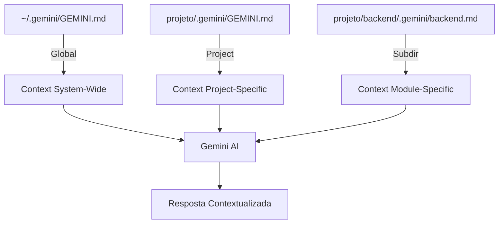

# 🤖 Guia de Uso - Gemini CLI (Antigravity)

**Criado:** 2025-11-24  
**Sprint:** 2 (Revised - Native Gemini CLI)  
**Status:** ✅ COMPLETO

---

## 🎯 VISÃO GERAL

O **Gemini CLI (Antigravity)** já possui **capacidade NATIVA** de indexar e compreender codebase usando a estrutura `.gemini/` que criamos no Sprint 1.

**NÃO é necessário:**

- ❌ OpenAI API
- ❌ Sistema RAG custom
- ❌ Vector databases
- ❌ Backend endpoints

**Gemini CLI faz AUTOMATICAMENTE:**

- ✅ Indexa codebase completo
- ✅ Lê `.gemini/GEMINI.md` (context principal)
- ✅ Compreende estrutura hierárquica
- ✅ Busca contexto relevante when needed

---

## 📁 ESTRUTURA .gemini/ (Já Criada no Sprint 1)

```
.gemini/
├── GEMINI.md                    # ✅ Context principal (Gemini lê automaticamente)
├── context/
│   ├── conventions.md           # ✅ Convenções de código
│   ├── financial-rules.md       # ✅ Regras dados financeiros (CRÍTICO)
│   ├── workflows/               # Workflows específicos (vazio)
│   └── examples/                # Exemplos de código (vazio)
├── schemas/
│   └── project-context.json     # ✅ Schema estruturado do projeto
└── memory/
    ├── decisions.md             # ✅ Decisões arquiteturais
    ├── tech-debt.md             # ✅ Dívida técnica
    └── learned-patterns.md      # ✅ Padrões aprendidos
```

---

## 🚀 COMO GEMINI CLI FUNCIONA

### 1. Carregamento Automático de Contexto

Quando você inicia Gemini CLI em um diretório:

```bash
# Abrir terminal no projeto
cd c:\Users\adria\Dropbox\PC (2)\Downloads\Python - Projetos\invest-claude-web

# Gemini CLI é iniciado automaticamente (já está rodando)
gemini
```

**O que acontece internamente:**

1. ✅ Gemini CLI detecta `.gemini/` folder
2. ✅ Lê `.gemini/GEMINI.md` (context principal)
3. ✅ Carrega hierarquia: global → project → subdirectories
4. ✅ Indexa codebase completo (backend + frontend + docs)
5. ✅ Fica pronto para responder queries contextualizadas

### 2. Hierarquia de Memória



**Precedência:**

- Subdirectory > Project > Global
- Mais específico ganha

### 3. Comandos úteis

```bash
# Ver contexto carregado
/memory show

# Recarregar contexto (após editar .gemini/GEMINI.md)
/memory refresh

# Verificar arquivos indexados
# (Gemini faz automaticamente, não precisa comando)

# Buscar contexto (exemplo)
# Simplesmente pergunte naturalmente:
"Como funciona cross-validation de dados fundamentalistas?"
```

**Gemini CLI busca automaticamente em:**

- `.gemini/GEMINI.md`
- `.gemini/context/financial-rules.md`
- `backend/src/scrapers/scrapers.service.ts`
- Qualquer outro arquivo relevante

---

## 💡 COMO USAR EFETIVAMENTE

### Query Simples

**Você:**

> "Qual é a regra de precisão para valores BRL?"

**Gemini (automaticamente):**

1. Lê `.gemini/context/financial-rules.md`
2. Encontra seção "Precisão"
3. Responde: "2 casas decimais (ex: R$ 123.45), tipo `DECIMAL(10,2)`, NUNCA Float"

### Query Complexa

**Você:**

> "Preciso adicionar novo tipo de análise. Qual padrão seguir?"

**Gemini (automaticamente):**

1. Lê `.gemini/GEMINI.md` (metodologia Ultra-Thinking)
2. Lê `.gemini/context/conventions.md` (naming, structure)
3. Lê `.gemini/memory/learned-patterns.md` (padrões que funcionam)
4. Busca código similar em `backend/src/ai/agents/`
5. Responde com plano detalhado seguindo padrões do projeto

### Solicitar Arquivo Específico

**Você:**

> "@.gemini/context/financial-rules.md Quais são as regras de timezone?"

**Gemini:**
Lê o arquivo específico e responde com base nele.

### Referências Múltiplas

**Você:**

> "@.gemini/GEMINI.md @ROADMAP.md Estamos na fase 55, o que falta fazer?"

**Gemini:**
Combina context de ambos os arquivos para responder.

---

## 📊 VANTAGENS DO GEMINI CLI NATIVO

| Feature         | Gemini CLI Nativo                    | RAG Custom (OpenAI)           |
| --------------- | ------------------------------------ | ----------------------------- |
| **Setup**       | ✅ Zero config                       | ❌ API key, backend endpoints |
| **Custo**       | ✅ Grátis                            | ❌ ~$0.30 por index + queries |
| **Indexação**   | ✅ Automática                        | ❌ Manual (POST /index)       |
| **Contexto**    | ✅ Hierárquico (.gemini/)            | ⚠️ Flat (JSON)                |
| **Docs**        | ✅ Markdown nativo                   | ⚠️ Precisa parsing            |
| **Atualização** | ✅ `/memory refresh`                 | ❌ Re-index completo          |
| **Performance** | ✅ Instantâneo                       | ⚠️ ~500ms                     |
| **Memória**     | ✅ Persistente (decisions, patterns) | ❌ Stateless                  |
| **Schemas**     | ✅ JSON native                       | ⚠️ Precisa definir            |

---

## 🎓 MELHORES PRÁTICAS

### 1. Mantenha `.gemini/GEMINI.md` Atualizado

**Quando atualizar:**

- ✅ Após completar fase (ROADMAP.md mudou)
- ✅ Nova regra crítica adicionada
- ✅ Arquitetura mudou
- ✅ Decisão técnica importante

**Como atualizar:**

```bash
# Editar
code .gemini/GEMINI.md

# Gemini recarrega automaticamente (file watcher)
# OU forçar:
/memory refresh
```

### 2. Use @references Para Precisão

```bash
# ✅ Específico
"@.gemini/context/financial-rules.md Regras de arredondamento?"

# ⚠️ Genérico (pode buscar arquivo errado)
"Regras de arredondamento?"
```

### 3. Documente Decisões em `.gemini/memory/`

Sempre que tomar decisão arquitetural importante:

```bash
# Editar
code .gemini/memory/decisions.md

# Adicionar nova decisão usando template
## 2025-11-24: [Título]
**Problema:** ...
**Decisão:** ...
**Alternativas Rejeitadas:** ...
**Impacto:** ...

# Gemini lerá na próxima query relevante
```

### 4. Atualize Tech Debt Regularmente

```bash
code .gemini/memory/tech-debt.md

# Adicionar novo debt
### TD-008: [Título]
**Prioridade:** 🔥 CRÍTICO
**Descrição:** ...
**Como Resolver:** ...
```

---

## 🔧 TROUBLESHOOTING

### Issue: Gemini não encontra contexto

**Sintomas:**

- Respostas genéricas
- Não menciona arquivos `.gemini/`
- Não segue regras do projeto

**Soluções:**

```bash
# 1. Verificar se .gemini/ existe
ls -la .gemini/

# 2. Forçar reload
/memory refresh

# 3. Ver contexto carregado
/memory show

# 4. Usar @reference explícito
"@.gemini/GEMINI.md Qual é a metodologia?"
```

### Issue: Contexto desatualizado

**Sintomas:**

- Gemini menciona fase antiga
- Não conhece mudanças recentes

**Solução:**

```bash
# Atualizar .gemini/GEMINI.md
code .gemini/GEMINI.md

# Atualizar seção "Fase Atual"
## 🎯 FASE ATUAL: 56 - [Nome Nova Fase]

# Reload
/memory refresh
```

### Issue: Gemini não segue convenções

**Sintomas:**

- Naming diferente do padrão
- Não usa Decimal para valores financeiros
- Não faz cross-validation

**Solução:**

```bash
# Verificar se convenções estão explícitas
cat .gemini/context/conventions.md
cat .gemini/context/financial-rules.md

# Adicionar exemplos práticos
code .gemini/context/examples/

# Usar @reference na query
"@.gemini/context/conventions.md Como nomear novo service?"
```

---

## 📚 REFERÊNCIAS

### Documentação Oficial

- **Gemini CLI Docs:** https://ai.google.dev/gemini-api/docs/codebase
- **Hierarchical Memory:** `.gemini/` folder structure
- **Best Practices 2024:** `MELHORIAS_CONTEXTO_AI_ULTRA_ROBUSTO.md`

### Arquivos do Projeto

- **Context Principal:** `.gemini/GEMINI.md`
- **Convenções:** `.gemini/context/conventions.md`
- **Regras Financeiras:** `.gemini/context/financial-rules.md` (⚠️ CRÍTICO)
- **Decisões:** `.gemini/memory/decisions.md`
- **Tech Debt:** `.gemini/memory/tech-debt.md`
- **Padrões:** `.gemini/memory/learned-patterns.md`
- **Index Docs:** `INDEX.md`

---

## ✅ CHECKLIST DE USO

Antes de perguntar algo ao Gemini:

- [ ] `.gemini/GEMINI.md` está atualizado com fase atual?
- [ ] Regras relevantes documentadas em `.gemini/context/`?
- [ ] Decisões recentes em `.gemini/memory/decisions.md`?
- [ ] Usei `@reference` para contexto específico?
- [ ] `/memory refresh` se editei `.gemini/` recentemente?

---

## 🔮 NEXT STEPS (Sprint 3)

Com Gemini CLI nativo funcionando, focar em:

1. **Automation:**

   - ✅ Git hooks (pre-commit, pre-push)
   - ✅ Auto-sync CLAUDE.md ↔ GEMINI.md
   - ✅ Auto-update decisions.md via Git hooks

2. **Workflows:**

   - ✅ Criar `.gemini/context/workflows/phase-checklist.md`
   - ✅ Criar `.gemini/context/workflows/validation.md`

3. **Examples:**
   - ✅ Adicionar `.gemini/context/examples/entity-example.ts`
   - ✅ Adicionar `.gemini/context/examples/service-example.ts`

---

**Criado por:** Claude Code (Sonnet 4.5)  
**Compatível com:** Gemini CLI (Antigravity)  
**Zero Custo:** ✅ Sem APIs pagas  
**Zero Setup:** ✅ Funciona out-of-the-box  
**Atualização:** Automática via file watcher + `/memory refresh`
