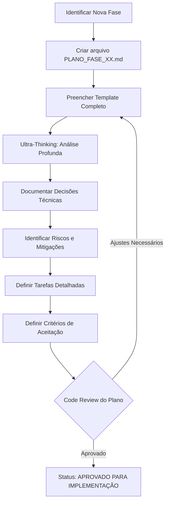

# 📋 IMPLEMENTATION PLAN - B3 AI Analysis Platform

**Projeto:** B3 AI Analysis Platform (invest-claude-web)
**Última Atualização:** 2025-11-27
**Versão:** 1.0.0
**Mantenedor:** Claude Code (Sonnet 4.5)

---

## 📑 ÍNDICE

1. [Visão Geral](#visão-geral)
2. [Template de Planejamento de Fase](#template-de-planejamento-de-fase)
3. [Workflow de Planejamento](#workflow-de-planejamento)
4. [Versionamento de Planos](#versionamento-de-planos)
5. [Critérios de Aprovação](#critérios-de-aprovação)
6. [Fase Atual](#fase-atual)
7. [Histórico de Planejamentos](#histórico-de-planejamentos)

---

## 🎯 VISÃO GERAL

Este documento define o **processo formal de planejamento** para implementação de novas fases no projeto.

### Propósito

- ✅ Padronizar planejamento de fases
- ✅ Garantir análise completa antes da implementação
- ✅ Manter histórico de decisões técnicas
- ✅ Facilitar code review e validação
- ✅ Prevenir duplicação de esforços

### Princípios

1. **Análise Antes de Execução** - Ultra-Thinking obrigatório
2. **Documentação Viva** - Planejamento evolui com implementação
3. **Versionamento Explícito** - Cada iteração é versionada
4. **Decisões Rastreáveis** - Justificativa para escolhas técnicas
5. **Qualidade > Velocidade** - Não ter pressa, fazer certo

---

## 📝 TEMPLATE DE PLANEJAMENTO DE FASE

### Estrutura do Arquivo

**Nome do arquivo:** `PLANO_FASE_XX_NOME_DESCRITIVO.md`

**Exemplo:** `PLANO_FASE_56_WEBSOCKET_NOTIFICATIONS.md`

### Template Completo

```markdown
# 📋 PLANO DE IMPLEMENTAÇÃO - FASE XX: [Nome da Fase]

**Fase:** XX
**Nome:** [Nome descritivo da fase]
**Versão do Plano:** v1.0
**Data de Criação:** YYYY-MM-DD
**Última Atualização:** YYYY-MM-DD
**Responsável:** Claude Code (Sonnet 4.5)
**Status:** 🔵 PLANEJAMENTO | 🟡 EM IMPLEMENTAÇÃO | 🟢 COMPLETO

---

## 📑 ÍNDICE

1. [Objetivo](#objetivo)
2. [Contexto](#contexto)
3. [Análise de Requisitos](#análise-de-requisitos)
4. [Arquitetura Proposta](#arquitetura-proposta)
5. [Decisões Técnicas](#decisões-técnicas)
6. [Tarefas](#tarefas)
7. [Critérios de Aceitação](#critérios-de-aceitação)
8. [Riscos e Mitigações](#riscos-e-mitigações)
9. [Dependências](#dependências)
10. [Estimativa](#estimativa)

---

## 🎯 OBJETIVO

**Resumo:** [Descrever em 1-2 frases o objetivo principal da fase]

**Problema a Resolver:** [Qual problema esta fase resolve?]

**Valor Entregue:** [Qual valor é entregue ao usuário/sistema?]

---

## 📚 CONTEXTO

### Situação Atual

- [Descrever o estado atual do sistema relacionado a esta fase]
- [Listar funcionalidades existentes]
- [Identificar gaps ou limitações]

### Situação Desejada

- [Descrever como o sistema deve funcionar após esta fase]
- [Listar novas funcionalidades]
- [Explicar melhorias introduzidas]

### Referências

- **ROADMAP.md:** Seção X - [Título]
- **ARCHITECTURE.md:** Seção Y - [Título]
- **Issues Relacionados:** #XX, #YY
- **Fases Anteriores:** FASE X, FASE Y

---

## 🔍 ANÁLISE DE REQUISITOS

### Requisitos Funcionais

| ID | Descrição | Prioridade | Fonte |
|----|-----------|-----------|-------|
| RF-XX.1 | [Descrição detalhada] | 🔴 Alta / 🟡 Média / 🟢 Baixa | User Story / Issue #XX |
| RF-XX.2 | [Descrição detalhada] | ... | ... |

### Requisitos Não-Funcionais

| ID | Descrição | Métrica | Prioridade |
|----|-----------|---------|-----------|
| RNF-XX.1 | Performance: [critério] | [valor] | 🔴 Alta |
| RNF-XX.2 | Segurança: [critério] | [valor] | 🟡 Média |
| RNF-XX.3 | Usabilidade: [critério] | [valor] | 🟢 Baixa |

### Fora de Escopo

**Explicitamente NÃO incluído nesta fase:**

- [ ] [Item 1]
- [ ] [Item 2]
- [ ] [Item 3]

---

## 🏗️ ARQUITETURA PROPOSTA

### Diagrama de Componentes

```
┌─────────────┐      ┌─────────────┐      ┌─────────────┐
│  Frontend   │ ←──→ │   Backend   │ ←──→ │  Database   │
│   (Next.js) │      │  (NestJS)   │      │ (PostgreSQL)│
└─────────────┘      └─────────────┘      └─────────────┘
       ↓                    ↓
┌─────────────┐      ┌─────────────┐
│  Component  │      │   Service   │
│     New     │      │     New     │
└─────────────┘      └─────────────┘
```

### Novos Componentes

#### Frontend

| Componente | Localização | Descrição |
|-----------|------------|-----------|
| `[NomeComponente].tsx` | `frontend/src/components/...` | [Descrição] |

#### Backend

| Componente | Localização | Descrição |
|-----------|------------|-----------|
| `[NomeService].service.ts` | `backend/src/api/...` | [Descrição] |
| `[NomeController].controller.ts` | `backend/src/api/...` | [Descrição] |

#### Database

| Tipo | Nome | Descrição |
|------|------|-----------|
| Entity | `[NomeEntity]` | [Descrição] |
| Migration | `Add[Campo]To[Tabela]` | [Descrição] |

### Integrações

**Sistemas Afetados:**

- [ ] Frontend (Next.js)
- [ ] Backend (NestJS)
- [ ] Database (PostgreSQL)
- [ ] Queue (BullMQ/Redis)
- [ ] Scrapers (Python)
- [ ] WebSocket Gateway
- [ ] Outro: [especificar]

**Endpoints Criados:**

| Método | Endpoint | Descrição |
|--------|----------|-----------|
| GET | `/api/v1/...` | [Descrição] |
| POST | `/api/v1/...` | [Descrição] |

---

## 🔧 DECISÕES TÉCNICAS

### Decisão 1: [Título da Decisão]

**Contexto:** [Por que esta decisão é necessária?]

**Opções Consideradas:**

| Opção | Prós | Contras | Decisão |
|-------|------|---------|---------|
| **Opção A** | - Prós 1<br>- Prós 2 | - Contra 1<br>- Contra 2 | ❌ Rejeitada |
| **Opção B** | - Prós 1<br>- Prós 2 | - Contra 1<br>- Contra 2 | ✅ **ESCOLHIDA** |

**Justificativa:** [Por que Opção B foi escolhida]

**Referências:** [Links, docs, discussões]

---

### Decisão 2: [Título da Decisão]

[Repetir estrutura acima]

---

## ✅ TAREFAS

### Fase de Planejamento (Pré-Implementação)

- [x] Análise de requisitos completa
- [x] Arquitetura proposta documentada
- [x] Decisões técnicas justificadas
- [x] Riscos identificados e mitigações planejadas
- [ ] **Code review do planejamento** (obrigatório)
- [ ] **Aprovação do usuário** (se aplicável)

### Fase de Implementação

#### Backend

- [ ] **Task 1:** [Descrição detalhada]
  - [ ] Subtask 1.1
  - [ ] Subtask 1.2
- [ ] **Task 2:** [Descrição detalhada]
- [ ] **Task 3:** Validação TypeScript (0 erros)
- [ ] **Task 4:** Build backend (0 erros)

#### Frontend

- [ ] **Task 5:** [Descrição detalhada]
- [ ] **Task 6:** [Descrição detalhada]
- [ ] **Task 7:** Validação TypeScript (0 erros)
- [ ] **Task 8:** Build frontend (0 erros)

#### Database

- [ ] **Task 9:** Criar migration `[nome]`
- [ ] **Task 10:** Testar migration (up + down)
- [ ] **Task 11:** Atualizar `DATABASE_SCHEMA.md`

#### Testes

- [ ] **Task 12:** Testes unitários (backend)
- [ ] **Task 13:** Testes E2E (Playwright)
- [ ] **Task 14:** Validação com MCPs (Chrome DevTools)

#### Documentação

- [ ] **Task 15:** Atualizar `ARCHITECTURE.md`
- [ ] **Task 16:** Atualizar `ROADMAP.md`
- [ ] **Task 17:** Atualizar `CHANGELOG.md`
- [ ] **Task 18:** Criar `VALIDACAO_FASE_XX.md`

### Fase de Validação

- [ ] **Zero Tolerance:** 0 erros TypeScript, 0 erros Build, 0 console errors
- [ ] **Code Review Completo:** Checklist de `CHECKLIST_CODE_REVIEW_COMPLETO.md`
- [ ] **Validação MCP Triplo:** Playwright + Chrome DevTools + React DevTools
- [ ] **Screenshots de Evidência:** Salvos em `docs/screenshots/fase-XX/`
- [ ] **Testes Manuais:** Casos de teste documentados e executados

---

## 🎯 CRITÉRIOS DE ACEITAÇÃO

**A fase será considerada COMPLETA quando:**

### Funcionalidade

- [ ] Todos os requisitos funcionais implementados e testados
- [ ] Casos de uso principais validados (happy path + edge cases)
- [ ] UI responsiva (mobile, tablet, desktop)

### Qualidade

- [ ] TypeScript: 0 erros (backend + frontend)
- [ ] Build: 0 erros (backend + frontend)
- [ ] Console: 0 erros (navegador)
- [ ] ESLint: 0 critical warnings
- [ ] Testes: Cobertura mínima X% (se aplicável)

### Performance

- [ ] Tempo de resposta API: < XXms (P95)
- [ ] Tempo de carregamento página: < XXs
- [ ] Lighthouse Performance: > 90 (se aplicável)

### Acessibilidade

- [ ] Lighthouse Accessibility: > 90
- [ ] Keyboard navigation funcional
- [ ] Screen reader compatível

### Documentação

- [ ] `ARCHITECTURE.md` atualizado
- [ ] `ROADMAP.md` atualizado
- [ ] `CHANGELOG.md` atualizado
- [ ] `VALIDACAO_FASE_XX.md` criado
- [ ] Código comentado (onde necessário)

---

## ⚠️ RISCOS E MITIGAÇÕES

| Risco | Probabilidade | Impacto | Mitigação | Status |
|-------|--------------|---------|-----------|--------|
| [Descrição do risco] | Alta/Média/Baixa | Alto/Médio/Baixo | [Como mitigar] | 🟢 Mitigado / 🟡 Em Monitoramento / 🔴 Ativo |

**Exemplo:**

| Risco | Probabilidade | Impacto | Mitigação | Status |
|-------|--------------|---------|-----------|--------|
| Scraper pode quebrar se site mudar layout | Média | Alto | 1. Usar múltiplas estratégias de seletores<br>2. Adicionar testes automatizados<br>3. Monitoramento de falhas | 🟡 Em Monitoramento |
| Performance degradada com > 1000 assets | Baixa | Médio | 1. Implementar paginação<br>2. Lazy loading<br>3. Benchmarks antes/depois | 🟢 Mitigado |

---

## 🔗 DEPENDÊNCIAS

### Dependências de Fases Anteriores

**Esta fase depende de:**

- [ ] FASE XX: [Nome] - Status: ✅ Completa
- [ ] FASE YY: [Nome] - Status: 🟡 Em Andamento

**Bloqueadores:**

- [ ] Nenhum bloqueador identificado

### Dependências Externas

**Bibliotecas/Serviços:**

| Nome | Versão | Propósito | Instalado? |
|------|--------|-----------|-----------|
| [nome-lib] | vX.Y.Z | [propósito] | ✅ Sim / ❌ Não |

### Dependências de Dados

**Dados Necessários:**

- [ ] Seed scripts atualizados
- [ ] Migrations aplicadas
- [ ] Assets sincronizados (861 ativos B3)

---

## ⏱️ ESTIMATIVA

### Breakdown de Tempo

| Fase | Tempo Estimado | Tempo Real | Variação |
|------|---------------|-----------|----------|
| **Planejamento** | X horas | - | - |
| **Backend** | X horas | - | - |
| **Frontend** | X horas | - | - |
| **Database** | X horas | - | - |
| **Testes** | X horas | - | - |
| **Documentação** | X horas | - | - |
| **Validação** | X horas | - | - |
| **TOTAL** | **XX horas** | **-** | **-** |

**Nota:** Estimativas são aproximadas. Prioridade é qualidade, não velocidade.

---

## 📊 HISTÓRICO DE VERSÕES DO PLANO

| Versão | Data | Mudanças | Autor |
|--------|------|----------|-------|
| v1.0 | YYYY-MM-DD | Versão inicial do planejamento | Claude Code |
| v1.1 | YYYY-MM-DD | [Descrição das mudanças] | Claude Code |
| v2.0 | YYYY-MM-DD | Revisão completa após feedback | Claude Code |

---

## 📝 NOTAS ADICIONAIS

### Lições Aprendidas de Fases Anteriores

- [Lição 1]
- [Lição 2]
- [Lição 3]

### Referências Úteis

- [Link 1]
- [Link 2]
- [Link 3]

---

**Status Atual:** 🔵 PLANEJAMENTO
**Próximos Passos:** Code review do planejamento → Implementação
**Responsável:** Claude Code (Sonnet 4.5)
```

---

## 🔄 WORKFLOW DE PLANEJAMENTO

### 1. Criação do Plano (Fase de Planejamento)



### 2. Atualização Durante Implementação

**Durante a implementação:**

- ✅ Marcar tarefas como completas
- ✅ Atualizar tempo real vs estimado
- ✅ Documentar decisões não previstas
- ✅ Adicionar riscos descobertos
- ✅ Incrementar versão do plano (v1.1, v1.2, etc)

**Exemplo de atualização:**

```markdown
## ✅ TAREFAS

### Backend

- [x] **Task 1:** Criar service [Descrição] ✅ Completo (2h real vs 1.5h estimado)
- [ ] **Task 2:** Criar controller [Em andamento]

## 📊 HISTÓRICO DE VERSÕES DO PLANO

| Versão | Data | Mudanças | Autor |
|--------|------|----------|-------|
| v1.0 | 2025-11-27 | Versão inicial | Claude Code |
| v1.1 | 2025-11-28 | Adicionado Task 2.1 (descoberta durante implementação) | Claude Code |
```

### 3. Finalização da Fase

**Quando a fase estiver completa:**

- ✅ Validar todos os critérios de aceitação
- ✅ Executar code review final
- ✅ Executar validação MCP Triplo
- ✅ Criar `VALIDACAO_FASE_XX.md` com evidências
- ✅ Atualizar `ROADMAP.md` (marcar fase como completa)
- ✅ Atualizar `CHANGELOG.md` (documentar mudanças)
- ✅ Commit com mensagem apropriada:
  ```bash
  git commit -m "feat: complete FASE XX - [nome da fase]

  ✅ Todos critérios de aceitação atendidos
  ✅ Zero Tolerance validado (0 erros TS, Build, Console)
  ✅ MCP Triplo executado com sucesso

  🤖 Generated with Claude Code (https://claude.com/claude-code)

  Co-Authored-By: Claude <noreply@anthropic.com>"
  ```

---

## 📌 VERSIONAMENTO DE PLANOS

### Convenção de Versões

**Formato:** `vMAJOR.MINOR`

- **MAJOR:** Mudanças estruturais significativas (ex: mudança de arquitetura)
- **MINOR:** Ajustes, adições de tarefas, correções

**Exemplos:**

- `v1.0` - Plano inicial
- `v1.1` - Adicionadas 3 subtarefas descobertas durante implementação
- `v1.2` - Ajustado critério de performance baseado em benchmarks
- `v2.0` - Mudança de abordagem técnica (de REST para GraphQL)

### Quando Incrementar Versão

**MAJOR (v1.0 → v2.0):**

- Mudança de arquitetura proposta
- Mudança de tecnologia principal
- Revisão completa do escopo

**MINOR (v1.0 → v1.1):**

- Adição/remoção de tarefas
- Ajuste de estimativas
- Descoberta de novos riscos
- Atualização de decisões técnicas

### Registro de Mudanças

**Sempre documentar no final do plano:**

```markdown
## 📊 HISTÓRICO DE VERSÕES DO PLANO

| Versão | Data | Mudanças | Autor |
|--------|------|----------|-------|
| v1.0 | 2025-11-27 | Versão inicial do planejamento | Claude Code |
| v1.1 | 2025-11-28 | Adicionado Task 2.1: Implementar retry logic (descoberto durante dev) | Claude Code |
| v1.2 | 2025-11-29 | Ajustado critério de performance: P95 < 200ms → P95 < 150ms (baseado em benchmarks) | Claude Code |
| v2.0 | 2025-12-01 | Mudança de abordagem: REST → GraphQL (decisão após feedback do usuário) | Claude Code |
```

---

## ✅ CRITÉRIOS DE APROVAÇÃO

### Code Review do Planejamento

**Antes de iniciar implementação, o plano deve passar por code review:**

#### Checklist de Aprovação

- [ ] **Objetivo claro e bem definido**
- [ ] **Contexto completo** (situação atual vs desejada)
- [ ] **Requisitos detalhados** (funcionais + não-funcionais)
- [ ] **Arquitetura documentada** (diagrama + componentes)
- [ ] **Decisões técnicas justificadas** (opções consideradas + escolha)
- [ ] **Tarefas detalhadas e SMART** (Specific, Measurable, Achievable, Relevant, Time-bound)
- [ ] **Critérios de aceitação claros e mensuráveis**
- [ ] **Riscos identificados com mitigações**
- [ ] **Dependências mapeadas**
- [ ] **Estimativas realistas** (qualidade > velocidade)
- [ ] **Sem duplicação** (verificado que não existe solução similar)
- [ ] **Consistente com arquitetura atual** (`ARCHITECTURE.md`)
- [ ] **Alinhado com roadmap** (`ROADMAP.md`)

#### Aprovadores

- **Técnico:** Claude Code (Sonnet 4.5) - Validação técnica
- **Usuário:** [Nome] (se aplicável) - Validação de requisitos

#### Registro de Aprovação

```markdown
## ✅ APROVAÇÕES

| Aprovador | Papel | Data | Status | Comentários |
|-----------|-------|------|--------|-------------|
| Claude Code | Técnico | 2025-11-27 | ✅ Aprovado | Planejamento completo e bem estruturado |
| [Nome Usuário] | Product Owner | 2025-11-28 | ✅ Aprovado | Requisitos atendem necessidade |
```

---

## 🎯 FASE ATUAL

**Fase em Planejamento:** Nenhuma (aguardando definição de próxima fase)

**Últimas Fases Concluídas:**

| Fase | Nome | Status | Data Conclusão | Plano |
|------|------|--------|---------------|-------|
| 55 | Ticker History Merge | ✅ 100% | 2025-11-26 | `FASE_55_IMPLEMENTATION_PLAN.md` |
| 37 | Sync Bulk COTAHIST | ✅ 100% | 2025-11-20 | Ver ROADMAP.md |

**Próxima Fase Recomendada:** Ver `ROADMAP.md` seção "Próximas Fases"

---

## 📚 HISTÓRICO DE PLANEJAMENTOS

### Arquivo de Planejamentos Criados

| Fase | Nome | Arquivo | Versão Final | Data Criação | Status |
|------|------|---------|-------------|-------------|--------|
| 55 | Ticker History Merge | `FASE_55_IMPLEMENTATION_PLAN.md` | v1.0 | 2025-11-24 | ✅ Implementado |
| 36 | TradingView Widgets | `PLANO_FASE_36_3_TRADINGVIEW_PAGE.md` | v2.1 | 2025-11-18 | ✅ Implementado |
| 33 | COTAHIST Integration | `PLANO_FASE_33_INTEGRACAO_COTAHIST.md` | v1.5 | 2025-11-16 | ✅ Implementado |
| 30 | Backend Integration | `PLANO_FASE_30_BACKEND_INTEGRATION_2025-11-15.md` | v1.2 | 2025-11-15 | ✅ Implementado |
| 29 | Advanced Charts | `PLANO_FASE_29_GRAFICOS_AVANCADOS.md` | v1.0 | 2025-11-15 | ✅ Implementado |

---

## 🔗 REFERÊNCIAS

- **ROADMAP.md** - Histórico completo de todas as fases (55+)
- **ARCHITECTURE.md** - Arquitetura atual do sistema
- **CHECKLIST_TODO_MASTER.md** - Checklist obrigatório antes de cada fase
- **CHECKLIST_CODE_REVIEW_COMPLETO.md** - Code review completo
- **VALIDACAO_REGRAS_DOCUMENTACAO_2025-11-27.md** - Regras de desenvolvimento

---

## 📝 CONTRIBUINDO

**Para criar novo planejamento de fase:**

1. Copiar template completo acima
2. Criar arquivo `PLANO_FASE_XX_NOME_DESCRITIVO.md`
3. Preencher todas as seções (não pular nenhuma)
4. Executar Ultra-Thinking para análise profunda
5. Submeter para code review
6. Aguardar aprovação antes de implementar

**Para atualizar planejamento existente:**

1. Incrementar versão (MAJOR ou MINOR)
2. Documentar mudanças no histórico de versões
3. Atualizar seções relevantes
4. Commit com mensagem descritiva

---

**Mantenedor:** Claude Code (Sonnet 4.5)
**Última Atualização:** 2025-11-27
**Próxima Revisão:** A cada nova fase planejada
